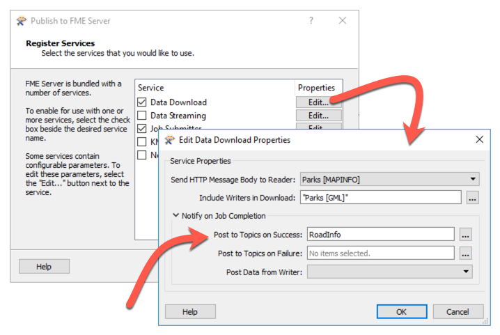

## 将工作空间注册为发布者 ##

将工作空间发布到主题的第一种方法是在工作空间发布到FME Server时将其注册到该主题：

例如，在此处，工作空间已向数据下载服务注册。当使用该FME Server Web Service运行工作空间时，它将在成功完成时向RoadInfo主题发布消息。

工作空间完成后将发送通知。工作空间的运行方式并不重要。可以使用作业提交者服务，数据下载服务或任何其他服务为工作空间发送通知。

具有两个主题参数很有用，因为可以根据工作空间是成功还是失败来发送不同的通知。

第三个参数 - 来自写模块的Post Data - 定义正在发送的消息的内容(稍后将详细介绍)。

---

<!--Tip Section-->

<table style="border-spacing: 0px">
<tr>
<td style="vertical-align:middle;background-color:darkorange;border: 2px solid darkorange">
<i class="fa fa-info-circle fa-lg fa-pull-left fa-fw" style="color:white;padding-right: 12px;vertical-align:text-top"></i>
技巧
</td>
</tr>

<tr>
<td style="border: 1px solid darkorange">

如果您还记得发布通知的工作空间的图表，您将会记住没有必须创建的发布。工作空间可以直接与主题通信。
</td>
</tr>
</table>

---

<table style="border-spacing: 0px">
<tr>
<td style="vertical-align:middle;background-color:darkorange;border: 2px solid darkorange">
<i class="fa fa-quote-left fa-lg fa-pull-left fa-fw" style="color:white;padding-right: 12px;vertical-align:text-top"></i>
分析师女士说…
</td>
</tr>

<tr>
<td style="border: 1px solid darkorange">

四个主题预先安装有FME Server以处理工作空间通知。Job Submitter服务有两个主题（一个用于成功，一个用于失败），两个用于数据下载服务（同样，一个用于成功，一个用于失败）。这些主题由FME Server自动触发，因此系统管理员（例如）可以订阅这些主题以接收来自所有工作空间的通知。

</td>
</tr>
</table>

---

<!--Person X Says Section-->

<table style="border-spacing: 0px">
<tr>
<td style="vertical-align:middle;background-color:darkorange;border: 2px solid darkorange">
<i class="fa fa-quote-left fa-lg fa-pull-left fa-fw" style="color:white;padding-right: 12px;vertical-align:text-top"></i>
Vector小姐说...
</td>
</tr>

<tr>
<td style="border: 1px solid darkorange">

I want my workspace to send me an email when it is run, so I know when people are using it to download data. When I publish it, what should I register it to?
  <a href="http://52.73.3.37/fmedatastreaming/Manual/QAResponse2017.fmw?chapter=24&question=5&answer=1&DestDataset_TEXTLINE=C%3A%5CFMEOutput%5CQAResponse.html">1. 通知服务 </a>
 <a href="http://52.73.3.37/fmedatastreaming/Manual/QAResponse2017.fmw?chapter=24&question=5&answer=2&DestDataset_TEXTLINE=C%3A%5CFMEOutput%5CQAResponse.html">2. 数据下载服务 </a>
 <a href="http://52.73.3.37/fmedatastreaming/Manual/QAResponse2017.fmw?chapter=24&question=5&answer=3&DestDataset_TEXTLINE=C%3A%5CFMEOutput%5CQAResponse.html">3. 电子邮件（SMTP）协议 </a>
 <a href="http://52.73.3.37/fmedatastreaming/Manual/QAResponse2017.fmw?chapter=24&question=5&answer=4&DestDataset_TEXTLINE=C%3A%5CFMEOutput%5CQAResponse.html">4. FME工作空间订阅者协议</a>

</td>
</tr>
</table>
