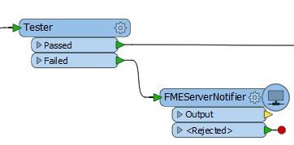
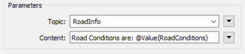

## 使用T转换器进行工作空间发布 ##

它可以通过名为*FMEServerNotifier*的转换器发送通知，而不是让工作空间在完成时发送通知。

这里，工作空间作者在要素未通过Tester转换器的条件时发送FME Server通知：

通知属性在转换器参数中设置。参数包括用于连接到FME Server的参数，一个用于要发布到的主题，一个用于要包含的消息。

在这里，作者打算将信息发布到名为RoadInfo的主题：

以这种方式发布通知有两个好处，过度使用注册方法：

- 工作空间可以在转换期间发出通知，而不是在结束时发出通知。

- 不需要在FME Server上运行工作空间以生成FME Server通知。使用FME Desktop运行时，它将生成相同的通知。

缺点是，在发出通知时，您不会知道工作空间是否成功完成。

---

<!--Tip Section-->

<table style="border-spacing: 0px">
<tr>
<td style="vertical-align:middle;background-color:darkorange;border: 2px solid darkorange">
<i class="fa fa-info-circle fa-lg fa-pull-left fa-fw" style="color:white;padding-right: 12px;vertical-align:text-top"></i>
技巧
</td>
</tr>

<tr>
<td style="border: 1px solid darkorange">

就像在工作空间完成时触发主题一样，此方法不需要创建发布。事实上，假设主题已经存在，可以设置此方法，而无需打开FME Server Web界面！

</td>
</tr>
</table>

---

<table style="border-spacing: 0px">
<tr>
<td style="vertical-align:middle;background-color:darkorange;border: 2px solid darkorange">
<i class="fa fa-quote-left fa-lg fa-pull-left fa-fw" style="color:white;padding-right: 12px;vertical-align:text-top"></i>
Vector小姐说…
</td>
</tr>

<tr>
<td style="border: 1px solid darkorange">

我有一个工作空间，可以读取50,000个要素，转换它们并将它们写出来。如果我想发送一个已经读取的要素能的通知，哪种转换器组合最常用？ 
  <a href="http://52.73.3.37/fmedatastreaming/Manual/QAResponse2017.fmw?chapter=24&question=6&answer=1&DestDataset_TEXTLINE=C%3A%5CFMEOutput%5CQAResponse.html">1. Creator/FeatureWriter/FMEServerNotifier</a>
 <a href="http://52.73.3.37/fmedatastreaming/Manual/QAResponse2017.fmw?chapter=24&question=6&answer=2&DestDataset_TEXTLINE=C%3A%5CFMEOutput%5CQAResponse.html">2. Creator/FMEServerJobSubmitter</a>
 <a href="http://52.73.3.37/fmedatastreaming/Manual/QAResponse2017.fmw?chapter=24&question=6&answer=3&DestDataset_TEXTLINE=C%3A%5CFMEOutput%5CQAResponse.html">3. Creator/FeatureReader/FMEServerNotifier</a>
 <a href="http://52.73.3.37/fmedatastreaming/Manual/QAResponse2017.fmw?chapter=24&question=6&answer=4&DestDataset_TEXTLINE=C%3A%5CFMEOutput%5CQAResponse.html">4. FeatureHolder/Sampler/FMEServerNotifier</a>

</td>
</tr>
</table>
