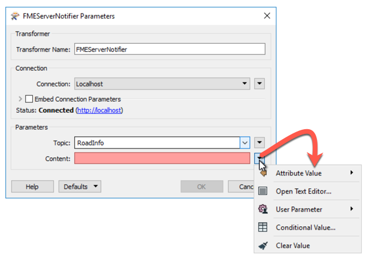
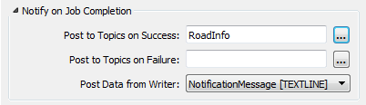
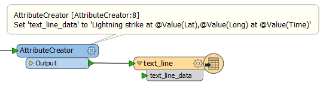
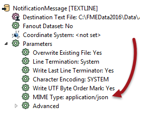

  

    <article class="markdown-body entry-content" itemprop="text"><h2>传出消息内容</h2>

当工作空间触发主题时，它可以包括（与其他发布者一样）消息。

构建来自各种来源（包括空间）的消息内容的能力是将FME工作空间用作发布者的关键原因。工作空间可以以多种方式转换数据，使用它来构造消息，然后将该消息作为通知分发给用户。

当FMEServerNotifier转换器触发主题时，消息可以由属性定义，在文本编辑器中构造，从用户参数获取，甚至可以设置为条件值：

通过使用服务主题注册工作空间来触发主题时，将通过写模块发送消息：

这里的消息正在通过文本文件写模块传递。

<h3>内容格式</h3>

出于FME通知的目的，工作空间发布的内容可以是任何格式，甚至是纯文本消息。但是，为了基于Web的订阅者的利益，传出消息通常是JSON或XML格式。

例如，这里工作空间使用AttributeCreator构造纯文本天气（闪电）警报。消息属性连接到文本文件写模块，以便提供发布传出消息的方法：

重要的是，文本文件写模块具有可以应用的MIME类型设置：

因此，即使消息是JSON或XML，标准做法是使用文本写模块。

<table>
<tbody><tr>
<td>
<i></i>
分析师女士说......
</td>
</tr>
<tr>
<td>

无论格式如何，文本文件写模块都是提供消息的最常用方法。即使消息被构造为JSON或XML片段，它仍然会通过文本文件写模块传递。

</td>
</tr>
</tbody></table>

<h3>在工作空间中发送电子邮件内容</h3>

传递出工作空间的消息可能需要采用电子邮件的形式。与任何其他消息一样，这可以通过使用转换器构建为属性。

例如，对于JSON格式的电子邮件，您可以构造如下属性：

<pre>{
“email_to”：“notifications@enduser.com”，
“email_cc”：“”，
“email_from”：“notifications@fmeserver.com”，
“email_replyto”：“”，
“email_subject”：“Notification Subject”，
“subscriber_content”：“Notification Content”
}
</pre>

这可以使用AttributeCreator转换器创建，其中电子邮件地址和内容可以根据需要用属性或参数值替换。

实际的电子邮件内容可以是纯文本，或者如果在通知GUI中将电子邮件格式设置为HTML，则可以将其构造为HTML。

<table>
<tbody><tr>
<td>
<i></i>
分析师女士说......
</td>
</tr>
<tr>
<td>

FMEServerEmailGenerator是FME Workbench中提供的自定义转换器，用于以正确的格式和结构生成电子邮件内容

</td>
</tr>
</tbody></table>
</article>
  

