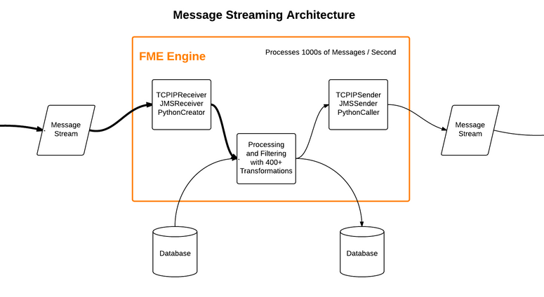

## 消息流体系结构 ##

接收和发送消息的消息流体系结构如下所示：

- 消息流通过一个可用的转换器（例如JMSReceiver）读入工作空间
- 根据项目的需要，每条消息都由任何可用的FME转换器处理
- 消息流通过一个可用的转换器（例如TCPIPSender）发送出工作空间

尽管该图显示了连续过程，但并不需要在设置中使用所有这些组件。如果系统只需要接收消息，则只需要一个接收者转换器。同样，如果系统仅用于发送消息，则只需要发送者转换器。

如果需要接收和发送消息，则所有组件都是必需的。但是，仍然可以将这些操作拆分为多个工作空间。

---

### 数据库 ###
此图中的数据库组件是可选的，但非常有用。消息通常需要针对其他一些数据集进行处理（例如覆盖地理围栏），数据库是读取和写入数据的最快解决方案。

从数据库读取的数据旨在用于处理传入消息。例如，消息可能表示用于过滤数据库数据（可能是交通状况）的点要素（可能是车辆位置）。

写入数据库的数据通常用于记录消息信息流。例如，可能每个传入消息都代表一个点要素（雷击），需要将其写入数据库以获取历史记录。

---

<table style="border-spacing: 0px">
<tr>
<td style="vertical-align:middle;background-color:darkorange;border: 2px solid darkorange">
<i class="fa fa-quote-left fa-lg fa-pull-left fa-fw" style="color:white;padding-right: 12px;vertical-align:text-top"></i>
Vector小姐说 …
</td>
</tr>

<tr>
<td style="border: 1px solid darkorange">

在高容量消息流设置中写入数据库需要将事务间隔设置为什么值？ 
  <a href="http://52.73.3.37/fmedatastreaming/Manual/QAResponse2017.fmw?chapter=24&question=8&answer=1&DestDataset_TEXTLINE=C%3A%5CFMEOutput%5CQAResponse.html">1. &lt;未设置&gt;</a>
 <a href="http://52.73.3.37/fmedatastreaming/Manual/QAResponse2017.fmw?chapter=24&question=8&answer=2&DestDataset_TEXTLINE=C%3A%5CFMEOutput%5CQAResponse.html">2. 零 (0)</a>
 <a href="http://52.73.3.37/fmedatastreaming/Manual/QAResponse2017.fmw?chapter=24&question=8&answer=3&DestDataset_TEXTLINE=C%3A%5CFMEOutput%5CQAResponse.html">3. 一 (1)</a>
 <a href="http://52.73.3.37/fmedatastreaming/Manual/QAResponse2017.fmw?chapter=24&question=8&answer=4&DestDataset_TEXTLINE=C%3A%5CFMEOutput%5CQAResponse.html">4. 无穷大 (&infin;)</a>

</td>
</tr>
</table>
