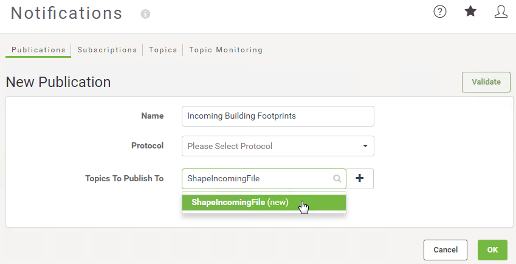
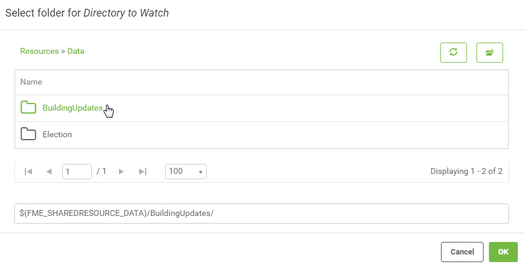
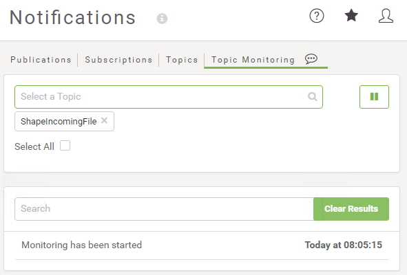

  

    <article class="markdown-body entry-content" itemprop="text">
<table>
<tbody><tr>
<td width="25%">
<i></i>
练习4.1
</td>
<td>
建筑物更新通知系统
</td>
</tr>
<tr>
<td>数据</td>
<td>建筑物足迹（Esri Shapefile）</td>
</tr>
<tr>
<td>总体目标</td>
<td>触发新文件的通知</td>
</tr>
<tr>
<td>演示</td>
<td>通知主题和目录监视发布</td>
</tr>
<tr>
<td>启动工作空间</td>
<td>N / A</td>
</tr>
<tr>
<td>结束工作空间</td>
<td>N / A</td>
</tr>
</tbody></table>

作为GIS部门的技术分析师，您希望开始在FME Server中尝试通知。目录监视协议似乎是一个很好的起点，您已经在考虑一个共享文件夹，用户可以在其中放置Shapefile数据集以添加或更新公司数据库。

 <strong>1）创建资源文件夹</strong>
 第一步是创建一个资源文件夹来复制数据。打开FME Server Web界面并导航到“资源”页面。

浏览到Data文件夹并创建一个名为BuildingUpdates的新子文件夹：

<table>
<tbody><tr>
<td>
<i></i>
Vector小姐说......
</td>
</tr>
<tr>
<td>

本练习使用FME Server资源文件夹，但FME Server中中也有本地支持来监视Amazon S3 bucket、Dropbox和FTP中的新资源。
 使用此处描述的相同概念，您可以使用这些协议之一而不是目录监视。
</td>
</tr>
</tbody></table>

 <strong>2）创建发布</strong>
 现在创建一个将由新文件触发的发布和主题。导航到“通知”页面，单击“发布”选项卡，然后单击“新建”按钮。

输入“Incoming Building Footprints”作为新发布的名称。

接下来，单击要发布到的主题旁边的文本框。键入ShapeIncomingFile，然后单击下拉列表中显示的具有该名称的条目。这将创建一个新主题并将其分配给此发布。

 <strong>3）设置发布协议</strong>
 现在从下拉列表中选择目录监视作为此发布的协议。在出现的对话框中，单击“要监视的目录”参数的“浏览”按钮，然后选择新创建的资源文件夹：

回到发布定义中，对于Filter参数，删除MODIFY和DELETE操作。我们要监视的是新文件到达，而不是旧文件被删除：

将轮询间隔更改为1分钟，然后单击确定以创建新发布。然后在右上角，单击“验证”按钮以验证发布。这可确保正确设置发布：

 <strong>4）监控主题</strong>
 单击“通知”页面上的“主题监控”选项卡。开始在Select a Topic搜索栏中键入ShapeIncomingFile，然后选择它。如果未出现该主题，则表示它不是使用该发布制作的。您可以在此处创建主题，但您需要返回“Incoming Building Footprints”发布并添加主题。

添加主题后，主题监控将自动开始，底部将显示一份备忘录，说明已启动监控及其启动时间。要开始或暂停监控，请单击顶部的播放或暂停按钮。

 
<table>
<tbody><tr>
<td>
<i></i>
技巧
</td>
</tr>
<tr>
<td>

监控主题时，“主题监控”选项卡需要保持打开状态。如果您要离开此页面，但希望继续监控主题，请使用FME Server打开新选项卡并继续工作。 

</td>
</tr>
</tbody></table>

 <strong>5）测试主题</strong>
 现在让我们测试一下这个主题。在C：\ FMEData2018 \ Data \ Engineering \ BuildingFootprints中找到源Shapefile数据集。为一个数据集选择一组文件（.dbf，.prj，.shp，.shx）并从中创建压缩的zip文件（右键单击&gt;发送到&gt;压缩（压缩）文件夹）。

现在将zip文件上传到新创建的资源文件夹中。有两种方法可以做到这一点。

您可以使用文件系统（通过将文件复制到C：\ ProgramData \ Safe Software \ FME Server \ resources \ data \ BuildingUpdates）或使用FME Server Web界面。如果您使用Web界面，请打开一个新窗口或选项卡，以便我们继续监视ShapeIncomingFile主题。

在“主题监控”窗口中进行检查，您将看到新文件已触发该主题：

<table>
<tbody><tr>
<td>
<i></i>
Vector小姐说......
</td>
</tr>
<tr>
<td>

请记住，发布设置为每分钟只检查一次文件夹 - 因此，如果主题监控没有立即显示结果，请不要惊慌！要有耐心，很快就会出现。
</td>
</tr>
</tbody></table>

现在我们知道目录监视通知如何工作！我们将在后续练习中看到如何处理这些信息。

 
<table>
<tbody><tr>
<td>
<i></i>
恭喜
</td>
</tr>
<tr>
<td>

通过完成本练习，您已学会如何：
 
<ul><li>创建一个新的发布</li>
<li>创建新主题作为创建发布过程的一部分</li>
<li>使用目录监视来触发主题和通知</li>
<li>使用主题监控测试发布和主题</li></ul>

</td>
</tr>
</tbody></table>   
</article>
  

