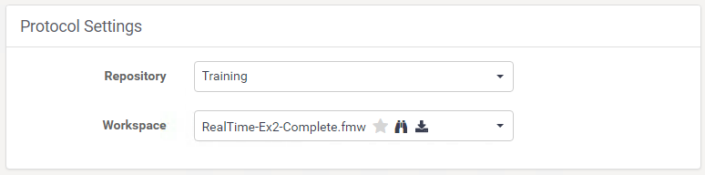

  

    <article class="markdown-body entry-content" itemprop="text">
<table>
<tbody><tr>
<td width="25%">
<i></i>
练习4.2
</td>
<td>
建筑更新通知系统
</td>
</tr>
<tr>
<td>数据</td>
<td>建筑足迹（Esri Shapefile）</td>
</tr>
<tr>
<td>总体目标</td>
<td>对数据库的实时更新</td>
</tr>
<tr>
<td>演示</td>
<td>运行工作空间以响应通知</td>
</tr>
<tr>
<td>启动工作空间</td>
<td>无</td>
</tr>
<tr>
<td>结束工作空间</td>
<td>C:\FMEData2018\Workspaces\ServerAuthoring\RealTime-Ex2-Complete.fmw
</td>
</tr>
</tbody></table>

作为GIS部门的技术分析师，您已经意识到将手动更新推送到公司数据库的相关开销。阅读完FME Server中的通知后，您认为应该可以设置一个自动执行此过程的系统。

到目前为止，您已经设置了一个系统，用于添加要由FME Server注册的文件通知。现在，您必须创建一个工作空间来处理这些工作空间并将其发布到FME Server。然后，必须通过通知主题触发工作空间。

<table>
<tbody><tr>
<td>
<i></i>
Vector小姐说......
</td>
</tr>
<tr>
<td>
这个练习在练习1结束的地方继续。你必须完成练习1才能进行这个练习。
</td>
</tr>
</tbody></table>

 <strong>1）创建工作空间</strong>
 启动FME Workbench并从空工作空间开始。只需添加一个Creator和Logger转换器：

这将为我们提供一个工作空间来响应新文件; 虽然还没有做多少。我们只是创建它来检查我们是否可以使设置正常工作。

 <strong>2）保存并发布工作空间</strong>
 保存工作空间并将其发布到FME Server。我们只需要运行它（不做任何特殊操作），所以只能使用Job Submitter服务注册它。

 <strong>3）创建订阅</strong>
 返回到FME Server Web界面并导航到“通知”页面。单击“订阅”选项卡，然后单击“新建”以创建新的订阅。

调用订阅“Process Building Updates”。订阅ShapeIncomingFile主题：

现在将协议设置为FME Workspace并选择上一步中上传的工作空间：

单击“确定”以创建订阅。每次传入的Shape数据集触发ShapeIncomingFile主题时，这将导致工作空间运行。

 <strong>4）测试订阅</strong>
 在Windows资源管理器中，压缩update002.shp / .dbf / .shx / .prj文件。然后返回FME Server，通过上传update002.zip文件测试订阅。

<em><strong>注意：</strong></em> <em>由于我们将目录监视设置为仅监视新文件，因此上传的Shapefile应与第一个不同 - 或者至少具有不同的名称。</em>

这一次，不是监视主题（虽然它会再次出现），请检查“作业”页面。您应该看到已运行工作空间以响应新文件：

这证明工作空间已经运行。

 
<table>
<tbody><tr>
<td>
<i></i>
恭喜
</td>
</tr>
<tr>
<td>

通过完成本练习，您已学会如何：
 
<ul><li>创建新的FME工作空间订阅</li>
<li>配置订阅以运行工作空间以响应主题触发</li>
<li>通过在“已完成的作业”页面上验证其成功来测试通知系统</li></ul>

</td>
</tr>
</tbody></table>   
</article>
  

