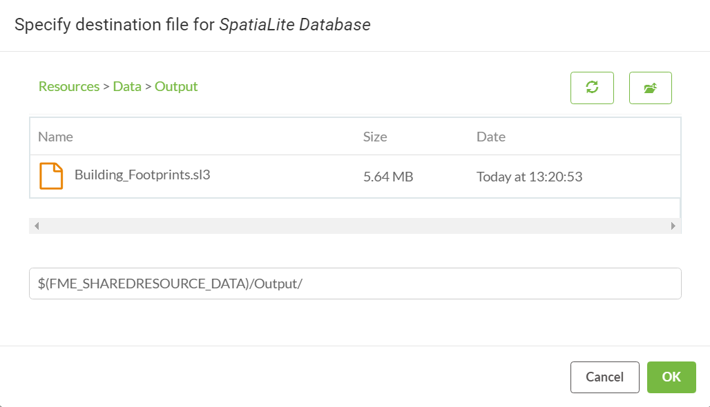

  

    <article class="markdown-body entry-content" itemprop="text">
<table>
<tbody><tr>
<td width="25%">
<i></i>
练习4.3
</td>
<td>
建筑更新通知系统
</td>
</tr>
<tr>
<td>数据</td>
<td>建筑脚印（Esri Shapefile）</td>
</tr>
<tr>
<td>总体目标</td>
<td>触发对数据库的实时更新</td>
</tr>
<tr>
<td>演示</td>
<td>处理目录监视通知</td>
</tr>
<tr>
<td>启动工作空间</td>
<td>无</td>
</tr>
<tr>
<td>结束工作空间</td>
<td>C:\FMEData2018\Workspaces\ServerAuthoring\RealTime-Ex3-Complete.fmw
</td>
</tr>
</tbody></table>

现在您已经学会了如何运行工作空间以响应通知，现在是时候采用该基本工作空间并根据您的总体目标进行调整：为您的公司数据库提供实时更新。

实现此目标的下一步是了解如何从通知中提取信息并配置FME工作空间以处理传入的数据。

<table>
<tbody><tr>
<td>
<i></i>
Vector小姐说......
</td>
</tr>
<tr>
<td>
这个练习在练习2结束的地方继续。你必须完成练习2才能进行这个练习。
</td>
</tr>
</tbody></table>

 <strong>1）创建工作空间</strong>
 启动FME Workbench并从空工作空间开始。

从菜单栏中选择“读模块”&gt;“添加读模块”。提示时设置参数如下：

<table>
<tbody><tr>
<td>读模块格式</td>
<td>文本文件</td>
</tr>
<tr>
<td>读模块数据集</td>
<td>C:\FMEData2018\readme.txt</td>
</tr>
<tr>
<td>读模块参数</td>
<td>一次读取整个文件：是的</td>
</tr>
</tbody></table>

我们现在使用什么文本文件来源并不重要; 在此步骤中设置源数据集只是为了满足文本文件读模块的要求。在运行时，源数据集将被传入消息的内容替换。

 <strong>2）添加JSONFlattener</strong>
 现在在文本文件读模块之后将JSONFlattener转换器添加到工作空间。传入消息的格式为JSON，此转换器将在画布上暴露属性 - 使它们可用。

检查转换器参数，并在JSON Document参数下选择属性<em>text_line_data</em>作为JSON内容的来源。

将Logger转换器添加到JSONFlattener上的每个输出端口。

<table>
<tbody><tr>
<td>
<i></i>
Workbench博士说......
</td>
</tr>
<tr>
<td>

我们可以使用JSON读模块而不是使用文本读模块&gt; JSONFlattener。我们为什么不呢？JSON读模块需要一个具有有效模式的源文件。在练习的这个阶段，我们还没有具有此结构的文件。
</td>
</tr>
</tbody></table>

 <strong>3）发布到FME Server</strong>
 将工作空间发布到FME Server，在Job Submitter服务下注册它。

 <strong>4）更新订阅</strong>
 现在登录到FME Server Web界面并导航到“通知”页面。

单击“订阅”选项卡，然后选择现有的“Process Building Updates”订阅以对其进行编辑。

将指定的工作空间从练习2中创建的工作空间更改为上一步中上传的工作空间。

工作空间的更改将导致出现“源文本文件”参数。这里只需选中右侧的复选框，即<em>从主题消息中获取值</em>。

单击“确定”以更新订阅。

 <strong>5）测试主题</strong>
 再次（如在练习1和2中）在C：\ FMEData2018 \ Data \ Engineering \ BuildingFootprints中找到源Shapefile数据集update003.shp，并从Shapefiles集合中创建压缩（zip）文件（.dbf， .prj，.shp，.shx）。

请务必为之前使用过的zip文件指定一个不同的名称。

将zip文件复制到资源文件夹data \ BuildingUpdates中。您可以通过文件系统（通过将文件复制到C：\ ProgramData \ Safe Software \ FME Server \ resources \ data \ BuildingUpdates）或使用FME Server Web界面执行此操作。

 <strong>6）检查结果</strong>
 在Web界面中打开“作业”页面。已完成的作业列表应包括您在订阅中更新的工作空间。查看或下载日志文件并查找记录的要素。您应该会发现它有一个包含JSON的属性和从JSON中提取的许多属性。

<table>
<tbody><tr><td>dirwatch_publisher_action</td><td>CREATE(创建)</td></tr>
<tr><td>dirwatch_publisher_content</td><td>ENTRY_CREATE C：\ ProgramData \ Safe Software \ FME Server \ resources \ data \ BuildingUpdates \ update002.zip</td></tr>
<tr><td>dirwatch_publisher_path</td><td>C：\ ProgramData \ Safe Software \ FME Server \ resources \ data \ BuildingUpdates \ update002.zip</td></tr>
</tbody></table>

所以现在我们知道数据是什么样的，并且可以相应地处理它。

<table>
<tbody><tr>
<td>
<i></i>
Flibble先生说......
</td>
</tr>
<tr>
<td>

您可以从主题监控练习中识别这些属性 - 实际上您可以在那里查看相同的信息，而无需通过添加Logger转换器的过程！

</td>
</tr>
</tbody></table>

 <strong>7）编辑JSONFlattener转换器</strong>
 返回FME Workbench再次检查JSONFlattener转换器参数。在“要显示的属性” <em>下，</em>通过单击“浏览”按钮添加属性<em>dirwatch_publisher_path</em>，然后手动将其键入：

 <strong>8）添加FeatureReader转换器</strong>
 现在删除Logger转换器并将FeatureReader转换器添加到JSONFlattener的输出：

这是一个转换器，可以让我们在转换过程中将数据集的内容读入工作流。检查转换器的参数并设置以下值：

<table>
<tbody><tr><td><strong>读模块格式</strong></td><td>Esri Shapefile</td></tr>
<tr><td><strong>读模块数据集</strong></td><td>选择属性值&gt; dirwatch_publisher_path</td></tr>
<tr><td><strong>输出端口</strong></td><td>单输出端口</td></tr>
</tbody></table>

选择具有单输出端口：

 <strong>9）添加写模块</strong>
 从Shapefile读取数据后，我们现在可以将它添加到公司数据库中。

从菜单栏中选择Writers&gt; Add Writer。提示时设置参数如下：

<table>
<tbody><tr>
<td>写模块格式</td>
<td>SpatiaLite</td>
</tr>
<tr>
<td>写模块数据集</td>
<td>C:\FMEData2018\Data\Engineering\BuildingFootprints\building_footprints.sl3
</td>
</tr>
<tr>
<td>写模块参数</td>
<td>覆盖现有数据库：否</td>
</tr>
<tr>
<td>添加要素类型</td>
<td>表定义：手动</td>
</tr>
</tbody></table>

在创建的新要素类型中，将Table Name参数更改为<em>building_footprints</em>：

确保将表处理设置为“如果需要则创建”。单击“确定”关闭对话框，然后将新要素类型连接到FeatureReader转换器的&lt;Generic&gt;输出端口。

 <strong>10）检查数据</strong>
添加写模块后，单击building_footprints要素类型以显示弹出菜单。然后单击“检查”按钮以在FME Data Inspector中打开数据集。building_footprints.sl3数据集中已有数据，但我们应该注意数据的样子，这样一旦我们用新数据更新数据集，我们就会知道它在哪里发生了变化。红色框内的区域将是新数据的添加位置：

 <strong>10）重新发布工作空间</strong>
 返回FME Workbench，将工作空间发布回FME Server。如果您在本练习开始时打开了相同的FME Workbench会话，则可以使用工具栏上或“文件”菜单下的“重新发布”选项。

 <strong>11）将数据集添加到FME Server</strong>
 由于此通知系统的目的是<em>更新</em>我们的数据库 - 让我们确保它可以在FME Server中访问。为此，我们将<em>building_footprints.sl3</em> SpatiaLite数据库上传到FME Server的共享资源。

使用FME Server Web界面在<strong>资源&gt; Data中</strong>创建一个新文件夹<strong>Output</strong>并上传位于C：\ FMEData2018 \ Data \ Engineering \ BuildingFootprints \ building_footprints.sl3的文件<strong></strong>

 <strong>12）编辑订阅</strong>
 导航到“通知”页面并打开“处理建筑更新订阅”以进行编辑。现在，参数应包括输出数据库的参数。使用浏览按钮找到上一步中上传的数据库：

单击“确定”以保存更改。

 <strong>13）测试解决方案</strong>
 现在通过将update001.zip，update002.zip或update003.zip放入BuildingUpdates文件夹来<strong>测试解决方案</strong>。如果这些文件已存在，请先删除它们，然后重新添加它们。您会发现放入该文件夹的每个数据集都会添加到SpatiaLite数据库中。

检查“已完成的作业”页面以确认工作空间已运行。然后在FME Data Inspector中，添加一个新数据集，并浏览到C：\ ProgramData \ Safe Software \ FMEServer \ resources \ data \ Output \文件夹并添加building_footprints.sl3数据集。根据您添加的更新文件，您应该看到添加到数据集的三个建筑物之一：

<table>
<tbody><tr>
<td>
<i></i>
恭喜
</td>
</tr>
<tr>
<td>

通过完成本练习，您已学会如何：
 
<ul><li>识别传入主题消息上的JSON属性</li>
<li>使用FeatureReader转换器读取添加到监视文件夹的数据集</li></ul>

</td>
</tr>
</tbody></table>
</article>
  

