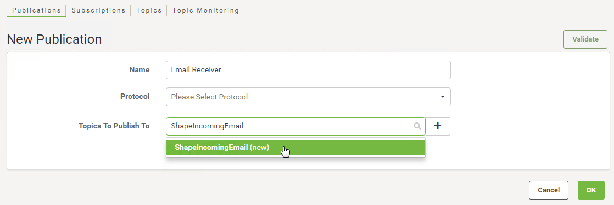
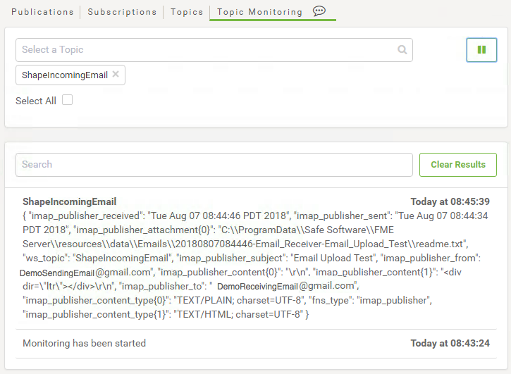
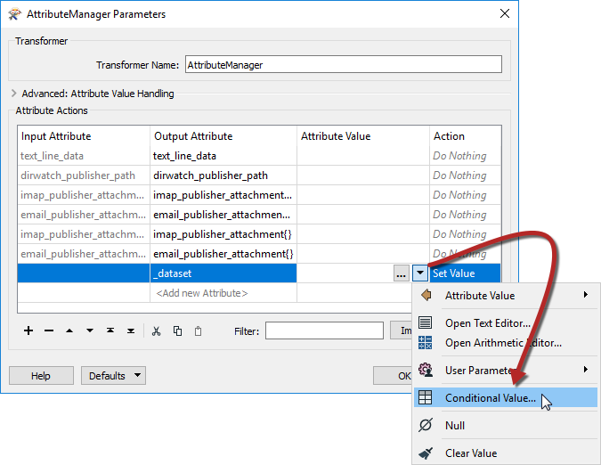
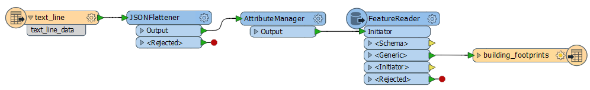
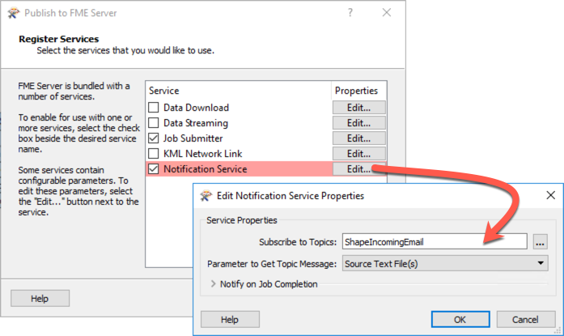

  

    <article class="markdown-body entry-content" itemprop="text">
<table>
<tbody><tr>
<td width="25%">
<i></i>
练习4.4
</td>
<td>
建筑更新通知系统
</td>
</tr>
<tr>
<td>数据</td>
<td>建筑足迹（Esri Shapefile）</td>
</tr>
<tr>
<td>总体目标</td>
<td>为更新提供电子邮件驱动的通知</td>
</tr>
<tr>
<td>演示</td>
<td>电子邮件发布和通知服务</td>
</tr>
<tr>
<td>启动工作空间</td>
<td>C:\FMEData2018\Workspaces\ServerAuthoring\RealTime-Ex4-Begin.fmw
</td>
</tr>
<tr>
<td>结束工作空间</td>
<td>C:\FMEData2018\Workspaces\ServerAuthoring\RealTime-Ex4-Complete.fmw
</td>
</tr>
</tbody></table>

作为GIS部门的技术分析师，您参与了最近的任务，即为用户设置目录监视解决方案，以自动更新企业数据库。

了解到并非所有用户都能够访问托管FME Server的内部网络，您认为应该可以设置使用基于电子邮件的自动化来处理相同更新的系统。

 <strong>1）创建资源文件夹</strong> 
第一步是创建另一个资源文件夹，其中将保存所有电子邮件附件。登录FME Server Web界面，导航到Resources&gt; Data，然后创建一个名为Emails的新文件夹。

 <strong>2）创建主题</strong>
 接下来，导航到通知页面。单击“发布”选项卡，然后选择“新建”。

输入“Email Receiver”作为名称。然后单击“要发布到的主题”下的文本框。输入<em>ShapeIncomingEmail</em>并单击它以添加。这将创建一个新的主题并将其分配给此发布。

可以创建新的发布以使用电子邮件（SMTP）协议或电子邮件（IMAP）协议。

SMTP更容易设置，但FME Server必须驻留在具有正确DNS记录的服务器上（所有FME 云和培训计算机都将具有此功能）。当FME Server驻留在内部网络上时，IMAP是必需的。

<em><strong>电子邮件协议</strong></em>

要使用SMTP协议，请选择电子邮件（SMTP）作为发布协议。这将打开“电子邮件用户名”参数。输入接收电子邮件的名称，例如：<em>fmeshapeprocessing</em>

单击“确定”将创建一个电子邮件地址<em>fmeshapeprocessing @ &lt;hostname&gt;</em> - 例如：

<table>
<tbody><tr><th>主机</th><th>示例电子邮件地址</th></tr>
<tr><td>FME云</td><td>fmeshapeprocessing@myfmeserver.fmecloud.com</td></tr>
<tr><td>亚马逊AWS</td><td>fmeshapeprocessing@ec1-23-456-789-012.compute-1.amazonaws.com</td></tr>
</tbody></table>

现在发送到该地址的所有电子邮件都将触发ShapeIncomingEmail主题。

<em><strong>IMAP协议</strong></em>

要使用IMAP协议，请选择电子邮件（IMAP）作为发布协议。这将打开许多其他参数。根据您的电子邮件帐户输入。

如果有用，Gmail，Outlook和Yahoo!的服务器信息 如下面所述：

<table>
<tbody><tr>
<td>IMAP服务器主机</td>
<td>imap.gmail.com</td>
<td>imap-mail.outlook.com</td>
<td>imap.mail.yahoo.com</td>
</tr>
<tr>
<td>服务器端口</td>
<td>993</td>
<td>993</td>
<td>993</td>
</tr>
<tr>
<td>连接安全</td>
<td>SSL / TLS</td>
<td>SSL / TLS</td>
<td>SSL / TLS</td>
</tr>
<tr>
<td>验证SSL证书</td>
<td>是</td>
<td>是</td>
<td>是</td>
</tr>
</tbody></table>

您还需要检查电子邮件帐户中的设置，以确保IMAP已打开。无论电子邮件提供商如何，您都应该按如下方式设置这些参数：

<table>
<tbody><tr>
<th>参数</th>
<th>值</th>
</tr>
<tr>
<td>轮询间隔</td>
<td>1分钟</td>
</tr>
<tr>
<td>电子邮件获取</td>
<td>仅限新电子邮件</td>
</tr>
<tr>
<td>下载附件</td>
<td>您选择的资源文件夹</td>
</tr>
</tbody></table>

您可以选择要保存的附件的任何资源文件夹; 但是（如果您已经完成了练习1-3）请不要选择BuildingUpdates文件夹，否则您将导致每个电子邮件附件触发前面的主题！

 <strong>3）测试发布</strong>
 现在让我们测试发布。在FME Server的“通知”页面中，单击标记为“主题”的选项卡。设置主题监控以观察<em>ShapeIncomingEmail</em>主题：

现在发送一封电子邮件<em>，其中附件</em>为为新发布选择的地址。当FME Server（SMTP）收到电子邮件或FME Server收到该邮件（IMAP）时，将通过消息触发该主题。（请记住，IMAP发布仅每60秒检查一次电子邮件，因此结果可能不会立即生效！）

回想一下，在上一个练习中，您使用Logger Protocol和Logger转换器来记录JSON格式的通知消息。“主题监控”窗口中显示相同的信息。因此，请复制“主题监控”窗口中的文本并将其粘贴到文本编辑器中，以便稍后在本练习中使用。

 <strong>4）更新工作空间</strong>
 您已经在FME Workbench中创建了一个工作空间来处理来自目录监视的传入通知。让我们修改工作流程，以便它可以使用两种发布协议。在FME Workbench中打开现有工作空间C：\ FMEData2018 \ Workspaces \ ServerAuthoring \ RealTime-Ex4-Begin.fmw。

打开JSONFlattener参数，并在Attributes to Expose下添加<em>imap_publisher_attachment {0}</em>和<em>email_publisher_attachment {0}</em>：

您可以看到这些是主题消息返回的两个可用属性。

<table>
<tbody><tr>
<td>
<i></i>
分析师女士说......
</td>
</tr>
<tr>
<td>

添加imap_publisher_attachment和email_publisher_attachment会修改此工作空间，以便它可以同时使用电子邮件（SMTP）和电子邮件（IMAP）发布！

</td>
</tr>
</tbody></table>

 <strong>5）添加AttributeManager</strong>
 下一步是插入一个转换器，用于确定数据的来源（目录监视或电子邮件发布） - 这是条件语句非常宝贵的任务。

在JSONFlattener和FeatureReader之间添加AttributeManager转换器。打开参数并添加<em>_dataset</em>作为新的输出属性。

从下拉菜单中选择将属性设置为条件值的选项：

配置条件值如下：

<table>
<tbody><tr>
<th>属性</th>
<th>测试</th>
<th>将_dataset设置为</th>
</tr>
<tr>
<td>dirwatch_publisher_path</td>
<td>属性有一个值</td>
<td>dirwatch_publisher_path</td>
</tr>
<tr>
<td>email_publisher_attachment {0}</td>
<td>属性有一个值</td>
<td>email_publisher_attachment {0}</td>
</tr>
<tr>
<td>imap_publisher_attachment {0}</td>
<td>属性有一个值</td>
<td>imap_publisher_attachment {0}</td>
</tr>
</tbody></table>

换一种说法：

<ul>
<li>如果<em>dirwatch_publisher_path</em>具有值，则将该值复制到<em>_dataset</em>属性中。</li>
<li>否则，如果<em>email_publisher_attachment {0}</em>具有值，则将该值复制到<em>_dataset</em>属性中。</li>
<li>否则，如果<em>imap_publisher_attachment {0}</em>具有值，则将该值复制到<em>_dataset</em>属性中。</li>
</ul>

因此<em>_dataset</em>获取要处理的数据的位置，无论是来自目录监视通知还是任何类型的电子邮件通知。

 <strong>6）编辑FeatureReader</strong>
 最后一步是更改FeatureReader转换器中的数据集参数。应该将其更改为指向新的_dataset属性，而不是指向dirwatch_publisher_path：

工作流现在应该如下所示：

 <strong>7）编辑用户参数</strong>
 与练习3一样，指定要写入FME Server资源文件夹的输出数据集。

找到用户参数DestDataset_SPATIALITE（在“导航”窗口中的“用户参数”&gt;“已发布参数”下），然后双击它以打开编辑器对话框。

在该对话框中输入：

<pre>    $（FME_SHAREDRESOURCE_DATA）/Output/building_footprints.sl3*
</pre>

 <strong>8）发布工作空间</strong>
 将此工作空间发布到FME Server，在通知服务下注册它。选择通知服务后，它将以红色突出显示，表示需要配置其参数。

单击“编辑”按钮并将“订阅主题”参数设置为<em>ShapeIncomingEmail</em>。将“获取主题消息的参数”设置为<em>Source Text File(s)源文本文件</em>：

 <strong>9）更新目录监视订阅（可选）</strong>
 如果您已完成练习3，使用FME Server Web界面，您可以将“处理建筑更新”订阅设置为指向此新工作空间。

 <strong>10）测试工作空间</strong>
 通过向发布电子邮件地址发送电子邮件来测试工作空间。请务必将C：\ FMEData2018 \ Data \ Engineering \ BuildingFootprints中的Shapefile数据集（.dbf，.prj，.shp，.shx）的zip文件附加到电子邮件中。

您可以通过在FME Server Web界面的Resources&gt; Data&gt; Output中选中Completed Jobs页面和SpatiaLite数据库的时间戳来验证工作流是否成功。

<table>
<tbody><tr>
<td>
<i></i>
恭喜
</td>
</tr>
<tr>
<td>

通过完成本练习，您已学会如何：
 
<ul><li>创建电子邮件发布</li>
<li>在发布过程中创建新的FME工作空间订阅</li>
<li>使用传入的电子邮件触发主题/通知</li>
<li>配置工作空间以处理多种发布类型的触发器</li></ul>

</td>
</tr>
</tbody></table>
</article>
  

