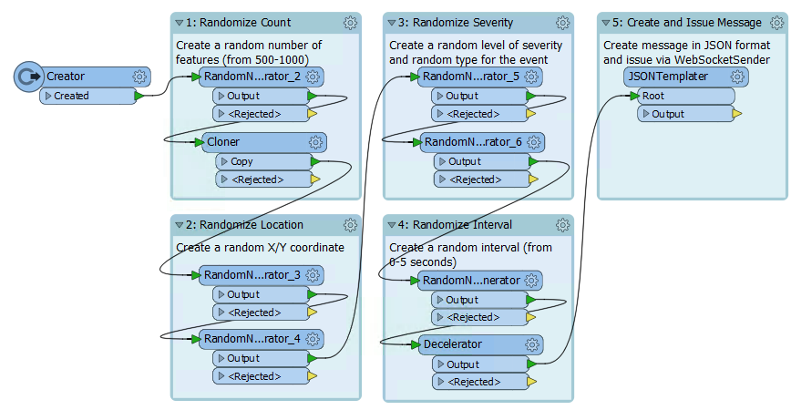
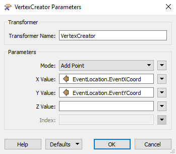
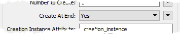
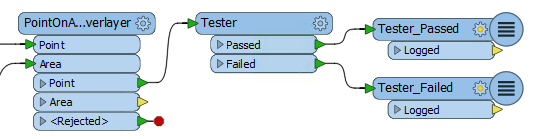
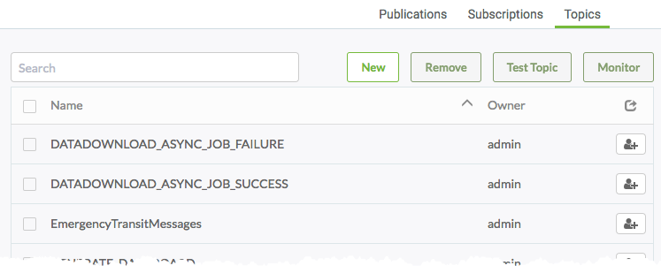
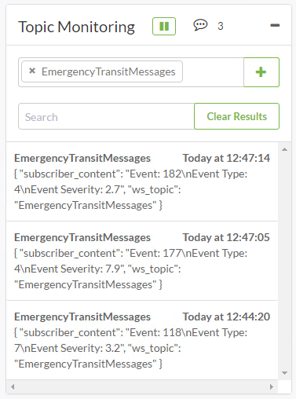

  

    <article class="markdown-body entry-content" itemprop="text">
<table>
<tbody><tr>
<td width="25%">
<i></i>
练习4.6
</td>
<td>
消息流：处理紧急电话呼叫流
</td>
</tr>
<tr>
<td>数据</td>
<td>事件消息（JSON）</td>
</tr>
<tr>
<td>总体目标</td>
<td>创建工作空间以读取，解析和过滤WebSocket消息; 仅保留影响交通站点的事件。</td>
</tr>
<tr>
<td>演示</td>
<td>创建工作空间以处理消息流</td>
</tr>
<tr>
<td>启动工作空间</td>
<td>C:\FMEData2018\Workspaces\ServerAuthoring\RealTime-Ex6-Begin.fmw
</td>
</tr>
<tr>
<td>结束工作空间</td>
<td>C:\FMEData2018\Workspaces\ServerAuthoring\RealTime-Ex6-Generate-Complete.fmw
  C:\FMEData2018\Workspaces\ServerAuthoring\RealTime-Ex6-Process-Complete.fmw
</td>
</tr>
</tbody></table>

作为GIS部门的技术分析师，您需要处理空间数据。有时您需要实时处理这些数据，有时数据可以大量且高速地到达。

在一个这样的情况下，该城市已被允许访问紧急服务的监控系统。这意味着能够访问有关所有紧急呼叫的实时信息。

<em>我们所说的紧急呼叫是指北美的911呼叫，英国的999呼叫，欧洲大部分的112呼叫以及澳大利亚的000呼叫。</em>

当然，这些呼叫可以以很快的速度到达，并且间隔时间不详。如果城市希望对这些请求作出响应，即使他们只想记录呼叫的历史记录，您也必须在FME Server中实施消息流设置。

 <strong>1）打开工作空间</strong>
 不幸的是(我是从培训的角度讲的)，我们无法访问实时的紧急电话流，所以我们必须自己生成。

打开工作空间C：\ FMEData2018 \ Workspaces \ ServerAuthoring \ DataStream-Ex1-Begin.fmw

请注意，工作空间会生成一系列事件。在随机时间和随机位置生成随机数量的事件。此外，还会生成随机严重性和事件类型属性。

每个事件都包含在JSON格式的消息中。我们需要做的就是将该消息作为流推送出去。

<table>
<tbody><tr>
<td>
<i></i>
Vector小姐说......
</td>
</tr>
<tr>
<td>

这个工作空间只是生成“事件”。这些事件可能是雷击，车辆位置，交通事故，甚至是不明飞行物的目击事件！在本练习中，我们假装他们是紧急电话。在现实生活中，您将连接到现有的数据流，而不需要以这种方式生成数据流。

</td>
</tr>
</tbody></table>

 <strong>2）添加WebSocketSender转换器</strong>
 在JSONTemplater之后添加WebSocketSender转换器。检查参数并将其设置如下：

<table>
<tbody><tr><td>WebSocket服务器URL</td><td>ws://localhost:7078</td></tr>
<tr><td>验证SSL证书</td><td>没有</td></tr>
<tr><td>连接前导</td>
<td>
<pre>{
    ws_op：“open”，
    ws_stream_id：“EmergencyEvents”
}
</pre>
</td></tr>
<tr><td>数据传输</td><td>
<pre>{
    ws_op：'send'，
    ws_msg：'@ Value（EventMessage）'
}
</pre>
</td></tr>
</tbody></table>

如您所见，这些参数打开WebSocket连接（到EmergencyEvents流）并发送信息（EventMessage属性）。保存参数，然后保存工作空间。

 <strong>3）创建工作空间</strong>
 现在我们能够生成数据流，我们将创建用于处理数据的工作空间。启动Workbench并以空白画布开始（不要关闭流生成器工作空间，因为我们稍后也需要它）。

在空白画布中添加Creator转换器并使用WebSocketReceiver在它后面。检查WebSocketReceiver转换器参数并将其设置如下：

<table>
<tbody><tr><td>WebSocket服务器URL</td><td>ws://localhost:7078</td></tr>
<tr><td>验证SSL证书</td><td>没有</td></tr>
<tr><td>连接前导</td><td>
<pre>{
    ws_op：“open”，
    ws_stream_id：“EmergencyEvents”
}
</pre>
</td></tr>
<tr><td>输出属性</td><td>IncomingMessage</td></tr>
</tbody></table>

保存更改并在WebSocketReceiver之后添加Logger转换器。

 <strong>4）发布工作空间</strong>
 让我们通过发布工作空间并在FME Server上运行它们来测试我们的工作空间。

依次发布每个工作空间。在这两种情况下都使用Job Submitter服务进行注册。我们不需要担心任何数据集或其他参数。

 <strong>5）运行工作空间</strong>
 登录FME Server Web界面，找到数据流生成器工作空间，然后运行它。对话框响应如下：

工作空间将运行很长时间，我们可以离开它这样做。通过单击主菜单上的“运行工作空间”按钮离开此页面，并在Run Workspace页面中——找到正在处理的工作空间。现在运行它。

同样，响应将报告工作区正在运行，并将继续运行。

 <strong>6）检查作业和取消</strong>
 导航到“作业”页面，然后单击标记为“正在运行”的选项卡。你会看到两个工作：

让工作运行一两分钟。然后选择它们中的每一个并单击“取消”按钮取消它们：

取消后，转到已完成的作业选项卡。你会看到两个被取消的工作：

单击处理工作空间作业并检查日志。您应该在日志中看到如下消息：

<pre>| ================================================= ==========================
INFORM | WebSocketReceiver_Output：功能是：
INFORM | ++++++++++++++++++++++++++++++++++++++++++++++++ +++++++++++++++++
INFORM |功能类型：'WebSocketReceiver_Output_LOGGED'
INFORM | Attribute（编码：utf-8）：'IncomingMessage'的值为'{“EventID”：6 .....
INFORM | Attribute（string）：'fme_geometry'的值为'fme_undefined'
INFORM | Attribute（编码：utf-8）：'fme_type'的值为'fme_no_geom'
INFORM |几何类型：未知（0）
</pre>

这证明了WebSocketReceiver正在按预期运行并从消息流接收消息。

<table>
<tbody><tr>
<td>
<i></i>
Vector小姐说......
</td>
</tr>
<tr>
<td>

您已经证明可以创建工作空间来处理消息流，这是本练习的重要部分。但如果你有时间，让我们看看我们可以添加哪些改进来使结果更加真实。

</td>
</tr>
</tbody></table>

 <strong>7）添加JSONFlattener</strong>
 处理传入消息的第一件事是将信息提取为属性。由于传入的数据是JSON格式，因此在WebSocketReceiver之后将JSONFlattener转换器添加到在处理的工作空间。

检查JSONFlattener的参数并将属性IncomingMessage设置为要处理的JSON文档。

在“要暴露的属性”下手动输入：

<ul>
<li>EventID</li>
<li>EventLocation.EventXCoord</li>
<li>EventLocation.EventYCoord</li>
<li>EventSeverity</li>
<li>EventType</li>
</ul>

现在，您可以在工作空间中将消息中的信息作为一组属性使用。

 <strong>8）添加VertexCreator</strong>
 现在添加一个VertexCreator转换器。将其设置为使用X / Y属性创建真正的点要素：

有了这个，我们现在有了一个真正的地理要素，可以根据需要进行处理。

 <strong>9）添加读模块</strong>
 城市内的公共交通团队已经了解到您正在使用此紧急数据。如果在交通站点200米范围内发生紧急事件，他们希望立即得到警报。让我们向他们展示设置它是多么容易。

首先我们需要交通站点数据，因此选择Readers&gt; Add Reader并添加以下内容：

<table>
<tbody><tr>
<td>读模块格式</td>
<td>Esri地理数据库（File Geodb Open API）</td>
</tr>
<tr>
<td>读模块数据集</td>
<td>C：\ FMEData2018 \ DATA \ CommunityMapping \ CommunityMap.gdb</td>
</tr>
</tbody></table>

出现提示时（或在参数对话框中），确保仅选择TransitStations表。

 <strong>10）过滤数据</strong>
 现在让我们过滤紧急情况。

首先，将Bufferer转换器添加到TransitStation要素类型，并将要素缓冲200米。

其次，添加PointOnAreaOverlayer以评估紧急情况是否属于其中一个缓冲区。工作空间现在看起来像这样：

目前有一个大问题阻止了这种工作。PointOnAreaOverlayer转换器是一个基于组的转换器，有时也称为“阻塞器(blocker)”。在输出任何数据之前，它将一直保留这些要素，直到它完成了这些要素的输入。在我们的例子中，我们希望使其成为基于要素的; 即，它将立即处理每个消息。

因此，检查PointOnAreaOverlayer参数并将Areas First设置为Yes：

这告诉转换器所有面要素（缓冲的站点）将首先到达; 因此，可以立即处理任何点要素（消息位置）。

但是，我们必须确保公交要素首先到达。因此，检查Creator转换器的转换器参数，并将Create at End设置为Yes：

现在，一切顺利，公交要素将首先到达PointOnAreaOverlayer转换器。

最后，在PointOnAreaOverlayer之后添加Tester转换器。设置测试以检查_overlaps&gt; 0（即消息位置落在交通站点缓冲区内）。将一些Logger转换器连接到Tester输出端口：

请注意，如果有其他参数（例如，公交团队只对事件类型7,8,9和10感兴趣），您也可以将它们添加到此测试程序中。

 <strong>11）发布工作空间</strong>
 现在再次发布两个工作空间（您可能需要也可能不需要将TransitStation地理数据库与工作空间一起上传）并使用与以前相同的过程运行它们，但可能需要更长时间，因为其中一个随机事件可能需要一段时间才能落入交通站点缓冲区。

一旦停止后，检查日志，您应该会看到位于交通站点200米以内的消息被记录下来(有一个不同的标题)。

<table>
<tbody><tr>
<td>
<i></i>
Vector小姐说......
</td>
</tr>
<tr>
<td>

如果要调整设置以更快地获得结果，那么请继续。例如，您可以将缓冲区大小设置为500米而不是200，或者可以减少消息生成器上的间隔时间。随意进行您喜欢的任何参数更改以测试设置。您甚至可以绕过Decelerator转换器（在数据流创建工作空间中）以查看FME处理传入消息的速度有多快！但是，如果这样做，请务必先启动处理的工作空间，否则，在启动处理器时，生成器可能已经完成!

</td>
</tr>
</tbody></table>

 <strong>12）添加写模块</strong>
 正在接收的消息并非全部由公交团队使用，但是我们应该对它们进行记录。所以 - 回到FME Workbench  - 从菜单栏中选择Writers&gt; Add Writer。使用以下参数向处理的工作空间添加数据库写模块:

<table>
<tbody><tr>
<td>写模块格式</td>
<td>SpatiaLite</td>
</tr>
<tr>
<td>写模块数据集</td>
<td>C:\FMEData2018\Output\EventMessages.sl3</td>
</tr>
<tr>
<td>写模块参数</td>
<td>高级:每个事务的特性= 1</td>
</tr>
<tr>
<td>添加要素类型</td>
<td>表定义：自动</td>
</tr>
</tbody></table>

在新添加的要素类型中，将名称更改为<em>events(事件)</em>并关闭对话框。将要素类型连接到VertexCreator输出端口（即我们记录所有事件，而不仅仅是过滤的事件）：

属性会自动添加，但包含一些我们不需要的属性。因此，再次为要素类型打开属性对话框，然后单击“用户属性”选项卡。将其从“自动”更改为“手动”并删除属性：

<ul>
<li>_creation_instance</li>
<li>incomingmessage</li>
<li>eventlocation_eventxcoord</li>
<li>eventlocation_eventycoord</li>
</ul>

请注意，属性已自动重命名（小写并删除不允许的字符）以符合SpatiaLite要求。

如果您发布并运行工作空间（您可能需要将SpatiaLite数据库输出设置为写入资源文件夹），现在您应该能够看到 - 当工作空间仍在运行时 - 结果将添加到数据库中。您可以在FME Data Inspector中检查该文件以证明这一点。

 <strong>13）创建通知</strong>
 最后一项任务（我保证）。经过过滤的消息对公交团队来说很重要，但目前他们还一无所获。我们应该建立一种方式来告知他们。

我们可以添加另一个消息传递转换器，例如WebSocketSender，JMSSender，SQSSender，甚至是Tweeter。这将使处理工作空间成为“纯粹”的消息传递工作空间。

另一方面，传出消息与传入消息的速率不同。使用本练习中描述的参数，每分钟只有一次传输消息。因此，我们可以通过设置要经过FME Server通知服务发送的输出消息来创建“混合”解决方案。

转到FME Server Web界面并导航到“通知”页面。

创建一个名为EmergencyTransitMessages的新主题：

现在创建一个与该主题相关的新通知订阅。我们可以实际使用各种协议来发送消息（在脑海中出现电子邮件），但是为了本练习的目的，使用Logger协议。将Log Level参数设置为High：

 <strong>14）添加FMEServerNotifier转换器</strong>
 在Workbench中的处理工作空间，删除工作空间末尾的所有Logger转换器。添加一个FMEServerNotifier转换器连接到Tester:Passed端口：

检查转换器参数并将其设置为向EmergencyTransitMessages主题发送消息。将邮件内容设置为您喜欢的任何内容。您可以使用文本编辑器对话框从可用属性中创建一些内容（它可以是纯文本，不必非要是JSON或XML）。

 <strong>15）发布和运行工作空间</strong>
 重新发布并重新设置工作空间。导航到“通知”页面，然后单击“主题”选项卡。启用主题监控以监视传入通知的EmergencyTransitMessages主题。

在短时间内，您将开始看到如下紧急消息：

访问Resources&gt; Logs&gt; core&gt; current&gt; subscribers&gt; logger.log，查找Logger协议通知记录的结果。

<table>
<tbody><tr>
<td>
<i></i>
恭喜
</td>
</tr>
<tr>
<td>

通过完成本练习，您已学会如何：
 
<ul><li>通过WebSockets发送和接收消息</li>
<li>发布并运行消息流工作空间</li>
<li>取消消息流工作空间并检查其日志文件</li>
<li>从JSON消息中提取属性</li>
<li>使用转换器来根据其内容转换和过滤消息</li>
<li>设置工作空间以在实时方案中处理基于组的转换器</li>
<li>将传入的消息记录到数据库中</li>
<li>设置具有消息流<strong>和</strong>通知的混合系统</li></ul>

</td>
</tr>
</tbody></table>
</article>
  

