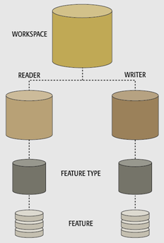

  

    <article class="markdown-body entry-content" itemprop="text"><h1>自助服务和参数</h1>

工作空间参数是控制自助服务和数据下载服务的关键。

<h2>什么是参数？</h2>

参数是控制FME转换和转换的内容。请记住，转换具有不同转换组件的层次结构：

层次结构的每个不同级别都有一组属于它的参数。这意味着：

<ul>
<li>工作空间参数</li>
<li>读模块参数</li>
<li>写模块参数</li>
<li>要素类型参数</li>
</ul>

大多数可用参数由工作空间的作者确定。

<table>
<tbody><tr>
<td>
<i></i>
厨师Bimm说......
</td>
</tr>
<tr>
<td>

在我的餐厅订购食物，我将决定需要多长时间烹饪，在什么温度下，以及使用什么设备。我还将决定它需要的调味料量以及展示它的样品。像FME作者一​​样，这些是控制结果的参数，作为用餐的创造者，我可以选择如何最好地设置它们。

</td>
</tr>
</tbody></table>

<h2>发布的参数</h2>

尽管工作空间作者设置了<em>大多数</em>参数，但在某些情况下，最终用户需要能够设置其中的一些参数。

<table>
<tbody><tr>
<td>
<i></i>
厨师Bimm说......
</td>
</tr>
<tr>
<td>

当然，我会让你对你的用餐做出一些决定。例如，我会让你决定你的牛排应该如何烹饪 - 三分熟、五分熟或全熟 - 以及你想添加什么酱。我也会让你选择配菜。这些是FME中的参数，用户可以使用而不是作者。

</td>
</tr>
</tbody></table>

为了使用户能够选择转换要求，FME包含称为<em>用户参数的</em>功能。用户参数是让输入进入到工作空间中的方法。

当用户参数可供最终用户使用时，它被称为<em>已发布参数</em>。在自助服务应用程序中，发布的参数对于让最终用户控制数据在样式和结构方面的服务方式非常重要。

<h2>在FME Server中使用参数</h2>

对于自助服务系统，发布的参数最常用于设置：

<ul>
<li>提供数据的坐标系统是什么</li>
<li>要素类型（图层）要传递什么</li>
<li>提供什么样的地理区域（边界框或感兴趣的区域）</li>
<li>用户使用的任何其他读模块，写模块或转换器参数</li>
</ul>

使用FME Server，成功创建工作空间的关键是灵活性。工作空间需要具有灵活性，以允许最终用户做出选择，而无需查看工作空间的所有复杂性或其背后的数据。参数是实现此目的的一种方法。

</article>
  

