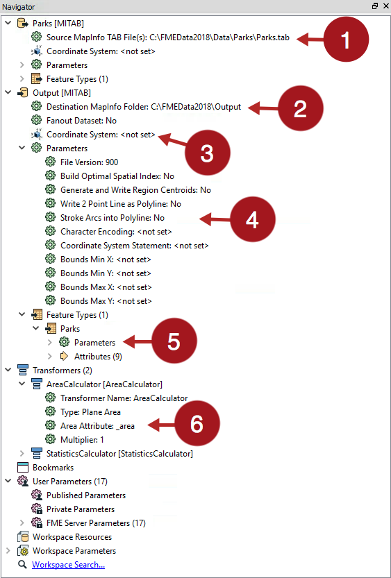
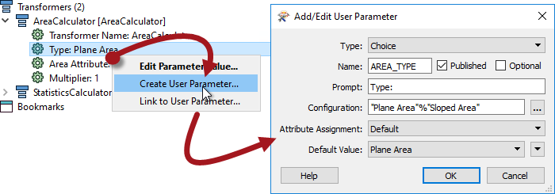
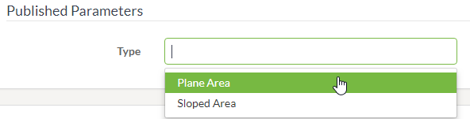

# 其他已发布的参数

可以发布FME中的任何参数，并将其作为运行工作空间时的选择呈现给用户。它们不必与数据下载服务具体相关。

参数在FME Desktop（即FME Workbench）中发布，以便在FME Server中使用。

---

## 发布参数 ##

在FME Workbench中，参数位于多个位置，FME工作台导航窗口是一个地方，你会发现他们聚集在一个单一的位置:

如您所见，源数据位置（1）和目标数据集（2）都有参数，这是数据下载服务覆盖的参数。还有用于控制坐标系（3）的参数，通用读模块和写模块参数（4），每种要素类型的参数（5）和转换器（6）的参数。

通过右键单击它们并选择“创建用户参数”来发布参数。例如，此处工作空间作者在LabelPointReplacer转换器上发布参数：

作者可以选择参数类型（在本例中为选择不同的固定值），用户提示和默认值。运行工作空间时，最终用户现在可以决定将参数设置为:

