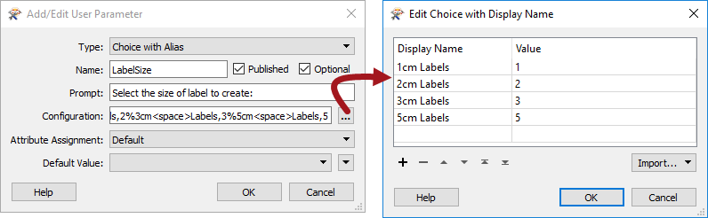

## 关键参数类型 ##

参数有多种类型，主要涉及所需的数据类型;例如整数、浮点数、字符串。但是，自助设置的两个关键参数类型是“别名选择（Choice with Alias）”和“脚本化（Scripted）”。

---

### 别名选择（Choice with Alias） ###

Choice参数是向用户呈现选项列表的地方，并且他们选择的选项将直接返回给FME。“别名选择”参数是相同的 - 用户被呈现了一个选择——但这次根据查找表将不同的值返回给FME。

例如，这里作者希望用户选择要在输出数据集中创建的标签的高度：

左边是(更直观的)选项列表，但是返回给FME的值将是(更有用的)右边的数字。

在FME Server上，此参数类型对于数据下载任务非常有用。这是因为我们想要传递给FME的许多值 - 例如，格式或坐标系名称 - 具有缩写格式，如果呈现给用户则没有意义。“别名选择”参数允许我们提供用户友好的选项列表，这些选项隐藏了对服务器的更复杂响应。

---

### 脚本化（Scripted） ###

脚本化参数是使用Python或Tcl脚本生成参数值的一种方法。

例如，在输出数据集中设置标签的大小可能比单个数字稍微复杂一些。它可能涉及与被标记的要素类型，正在生成的任何地图的比例，使用的坐标系以及许多其他因素相关的计算。

在这种情况下，脚本化参数可用于计算Python脚本中的所需值，并将其作为用户参数返回给FME。

最重要的是，脚本化参数可以包括对其他用户参数的引用; 例如，用户可以在选择参数中选择正在生成的地图的比例，并使用其作为因素之一计算标签高度。

在FME Server上，这对数据下载非常有用。这次是因为我们想要返回的一些值 - 例如，要素类型列表 - 需要从许多输入构造。脚本参数允许我们接受来自用户的输入并将其合并到脚本中，该脚本构造对服务器的实际的，更复杂的响应。

---

<!--Person X Says Section-->

<table style="border-spacing: 0px">
<tr>
<td style="vertical-align:middle;background-color:darkorange;border: 2px solid darkorange">
<i class="fa fa-quote-left fa-lg fa-pull-left fa-fw" style="color:white;padding-right: 12px;vertical-align:text-top"></i>
Vector小姐说...
</td>
</tr>

<tr>
<td style="border: 1px solid darkorange">

您对FME发布参数的类型有多了解？确定以下哪个是真实参数，哪些是假的。  
  <a href="http://52.73.3.37/fmedatastreaming/Manual/QAResponse2017.fmw?chapter=22&question=4&answer=1&DestDataset_TEXTLINE=C%3A%5CFMEOutput%5CQAResponse.html">1. 颜色</a>
 <a href="http://52.73.3.37/fmedatastreaming/Manual/QAResponse2017.fmw?chapter=22&question=4&answer=2&DestDataset_TEXTLINE=C%3A%5CFMEOutput%5CQAResponse.html">2. 双重</a>
 <a href="http://52.73.3.37/fmedatastreaming/Manual/QAResponse2017.fmw?chapter=22&question=4&answer=3&DestDataset_TEXTLINE=C%3A%5CFMEOutput%5CQAResponse.html">3. 密码</a>
 <a href="http://52.73.3.37/fmedatastreaming/Manual/QAResponse2017.fmw?chapter=22&question=4&answer=4&DestDataset_TEXTLINE=C%3A%5CFMEOutput%5CQAResponse.html">4. 文本（多行）</a>

</td>
</tr>
</table>
