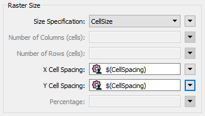
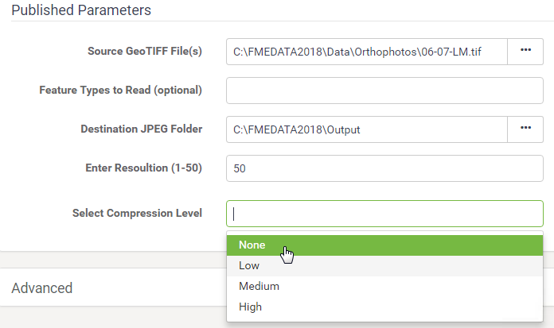

  

    <article class="markdown-body entry-content" itemprop="text">
<table>
<tbody><tr>
<td width="25%">
<i></i>
练习5.1
</td>
<td>
数据下载系统：已发布的参数
</td>
</tr>
<tr>
<td>数据</td>
<td>正射影像（GeoTIFF）</td>
</tr>
<tr>
<td>总体的目标</td>
<td>为正射影像创建FME Server数据下载系统</td>
</tr>
<tr>
<td>演示</td>
<td>在数据下载中为用户控制创建已发布的参数</td>
</tr>
<tr>
<td>启动工作空间</td>
<td>C:\FMEData2018\Workspaces\ServerAuthoring\SelfServe2-Ex1-Begin.fmw
</td>
</tr>
<tr>
<td>结束工作空间</td>
<td>C:\FMEData2018\Workspaces\ServerAuthoring\SelfServe2-Ex1-Complete.fmw
</td>
</tr>
</tbody></table>

作为一个城市GIS部门的技术分析师，您刚开始采取措施允许其他部门下载正射影像数据，而不是要求您为他们创建正射影像数据。他们的请求不仅会得到更快的处理，而且您还可以花更少的时间完成这项任务。

到目前为止，您已经创建了一个简单的工作空间来将正射影像转换为JPEG格式，并将其发布到FME Server上的数据下载服务。

现在，您需要开始自定义工作空间，以允许最终用户对输出进行一定程度的控制。

 <strong>1）打开工作空间</strong>
 打开上面列出的起始工作空间。你可以看到它由一个读模块，一个写模块和两个转换器组成。

在此步骤中，我们将让最终用户控制转换阶段。

 <strong>2）创建用户参数</strong>
 如果查看RasterResampler转换器的参数，您将看到X单元间距和Y单元间距的参数。我们应该让最终用户选择他们想要的间距。

因此，在FME Workbench的导航器窗口中，找到标记为“用户参数”的部分。右键单击那里并选择“创建用户参数”选项：

打开的对话框允许我们创建一个新参数。使用以下参数创建一个：

<table>
<tbody><tr><td>类型</td><td>数字</td></tr>
<tr><td>名称</td><td>CELLSPACING</td></tr>
<tr><td>发布的</td><td>是</td></tr>
<tr><td>可选的</td><td>没有</td></tr>
<tr><td>提示</td><td>输入分辨率（1-50）</td></tr>
<tr><td>配置</td><td>下限：大于值：0  上限：小于值：51  小数位数精度：0</td></tr>
<tr><td>默认值</td><td>50</td></tr>
</tbody></table>

单击“确定”关闭对话框。

 <strong>3）应用用户参数</strong>
 目前我们已经创建了一个用户参数，但没有将其应用到任何地方。

检查RasterResampler转换器的参数。单击X Cell Spacing参数右侧的下拉箭头，然后选择User Parameter&gt; CellSpacing。

对Y Cell Spacing参数执行相同操作。该对话框现在看起来像这样：

请注意，我们对X和Y单元格大小使用相同的值。没关系。虽然我们可以使用矩形（椭圆形）栅格单元，但在本练习中我们将使用正方形。

 <strong>4）创建用户参数</strong>
 我们可以给用户控制的另一个设置是文件压缩。这不是在转换器中定义的，而是在写模块要素类型中定义的。但是，我们仍然可以以相同的方式创建已发布的参数。

因此，在“导航”窗口中右键单击“用户参数”，然后再次选择“添加参数”。

这次我们会做一点点不同的事情。压缩可以是从零到一百的值，但我们将为用户提供“无”，“低”，“中”和“高”选项。

因此，使用以下内容创建参数：

<table>
<tbody><tr><td>类型</td><td>别名选择</td></tr>
<tr><td>名称</td><td>压缩</td></tr>
<tr><td>发布的</td><td>是</td></tr>
<tr><td>可选的</td><td>无</td></tr>
<tr><td>提示</td><td>选择压缩级别</td></tr>
</tbody></table>

对于配置字段，单击[...]浏览按钮。在打开的对话框中，设置以下内容：

<table>
<tbody><tr><th>显示名称</th><th>值</th></tr>
<tr><td>无</td><td>0</td></tr>
<tr><td>低</td><td>25</td></tr>
<tr><td>中</td><td>50</td></tr>
<tr><td>高</td><td>75</td></tr>
</tbody></table>

单击“确定”，再次单击“确定”关闭这些对话框并创建参数。

 <strong>5）应用用户参数</strong>
 要应用参数，请检查JPEG要素类型的参数。展开“压缩”参数（如有必要），并将“压缩级别”参数设置为“用户参数”&gt;“压缩”。

单击“确定”关闭对话框。如果您现在按下运行按钮 - 设置了提示选项 - 您将看到现在有两个新的单元格大小和压缩提示。

 <strong>6）发布和运行工作空间</strong>
 现在将工作空间发布到FME Server。将其发布到Training存储库，然后将其注册到数据下载服务。

通过FME Server Web界面找到工作空间并运行它。这次，系统将提示您设置单元格大小和压缩。

运行工作空间几次，改变单元大小和压缩，以确认参数是否有效。输出文件的大小可以很好地指示进程是否正常工作。

<table>
<tbody><tr>
<td>
<i></i>
恭喜
</td>
</tr>
<tr>
<td>

通过完成本练习，您已学会如何：
 
<ul><li>创建一个整数用户参数并将其应用于两个转换器参数</li>
<li>创建一个“选择”用户参数并将其应用于写模块要素类型参数</li>
<li>发布工作空间并使用已发布的参数</li></ul>

</td>
</tr>
</tbody></table>
</article>
  

