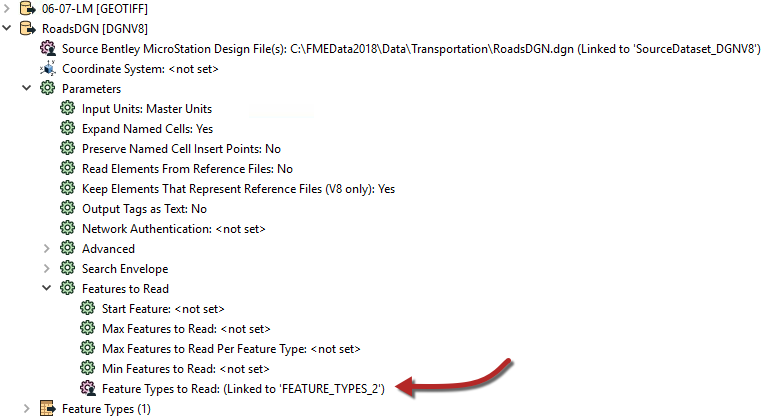
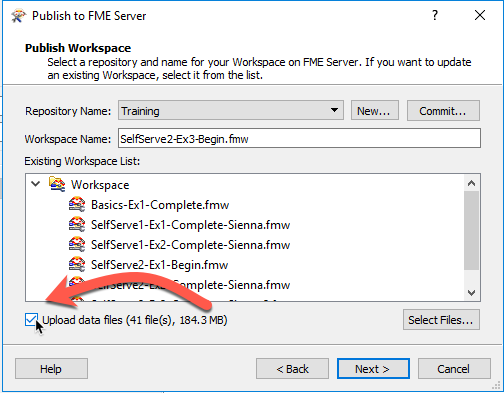

  

    <article class="markdown-body entry-content" itemprop="text">
<table>
<tbody><tr>
<td width="25%">
<i></i>
练习3
</td>
<td>
数据下载系统：层选择
</td>
</tr>
<tr>
<td>数据</td>
<td>正射影像（GeoTIFF）</td>
</tr>
<tr>
<td>总体的目标</td>
<td>为正射影像创建FME服务器数据下载系统</td>
</tr>
<tr>
<td>演示</td>
<td>添加矢量数据。处理数据下载中的层选择</td>
</tr>
<tr>
<td>启动工作空间</td>
<td>C:\FMEData2018\Workspaces\ServerAuthoring\SelfServe2-Ex3-Begin.fmw
</td>
</tr>
<tr>
<td>结束工作空间</td>
<td>C:\FMEData2018\Workspaces\ServerAuthoring\SelfServe2-Ex3-Complete.fmw
</td>
</tr>
</tbody></table>

作为一个城市GIS部门的技术分析师，您刚开始采取措施允许其他部门下载正射影像数据，而不是要求您为他们创建正射影像数据。他们的请求不仅会得到更快的处理，而且您还可以花更少的时间完成这项任务。

到目前为止，您已经创建了一个简单的工作空间来将正射影像转换为JPEG格式。为此，您已添加已发布的转换，格式和坐标系参数。工作空间已发布到FME Server上的数据下载服务。

转换正射影像数据时经常遇到的一个要求是在是在栅格上添加矢量数据作为叠加。。这在使用VectorOnRasterOverlayer转换器的FME中非常简单。但是，要在FME Server上部署它，意味着您需要让最终用户控制包含哪些矢量层。

 <strong>1）打开工作空间</strong>
 从练习2或上面列出的开始工作空间打开工作空间。您可以看到它包含一个读模块，两个写模块和两个转换器，以及一些已发布的参数。

要添加 - 例如 - 道路要素到栅格输出首先需要读模块来获取这些道路要素，这是第一步......

 <strong>2）添加读模块</strong>
 选择读模块&gt;添加读模块并使用以下设置：

<table>
<tbody><tr>
<td>读模块格式</td>
<td>BBentley MicroStation Design (V8)</td>
</tr>
<tr>
<td>读模块数据集</td>
<td>C:\FMEData2018\Data\Transportation\RoadsDGN.dgn
</td>
</tr>
<tr>
<td>读模块参数</td>
<td>分组元素依据：级别名称</td>
</tr>
<tr>
<td>工作流程选项</td>
<td>单一合并要素类型</td>
</tr>
</tbody></table>

我们将在这里使用单一合并要素类型选项，因为有多个源层，但是 - 因为它们作为一个组叠加在栅格上 - 我们实际上不需要以任何方式划分它们。

 <strong>3）添加VectorOnRasterOverlayer Transformer</strong>
 添加VectorOnRasterOverlayer转换器。将DGN要素类型连接到Vector输入端口，将RasterMosaicker转换器的输出连接到Raster输入端口：

您可以检查此转换器的参数，但至少现在，我们将保留原样。

 <strong>4）创建用户参数</strong>
 既然我们有一些源数据，我们可以创建一个参数来控制应该读取该数据中的哪些层。

在“导航”窗口中，找到DGN 读模块的参数，展开“要读取的要素”部分，然后找到名为“要读取的要素类型”的参数。您将看到它已经发布 - 我们使用单一合并要素类型的结果：

右键单击该参数，然后选择“编辑用户参数定义”。这将打开一个如下所示的对话框：

<table>
<tbody><tr>
<td>
<i></i>
空间FME教授，ETL说......
</td>
</tr>
<tr>
<td>

要读取的要素类型参数告诉FME从源读取哪些层。使用单一合并要素类型（或手动设置合并过滤器）时，它会自动发布。它也设置为自动更新。
  这意味着当提示最终用户选择要素类型时，FME将自动扫描源数据集以获取列表。这对于数据库特别有用，其中表列表（table list）通常会发生变化。但是，对于此工作空间，我们将假设一个固定的要素类型列表。

</td>
</tr>
</tbody></table>

 <strong>5）编辑用户参数</strong>
 在“修改要素类型列表”对话框中，选中标记为“固定列表（Fixed List）”的复选框，以及标记为“使用备用显示名称”的复选框。

单击列表&gt;从当前数据集添加，并在 - 提示时 - 选择此数据集中的所有要素类型。单击OK，对话框现在如下所示：

我们可以做的是为每种道路类型创建一个显示名称并关闭对话框。然后，最终用户将能够选择任何单个层。但是，对于这个项目，我认为我们应该给他们一个更简单的选择，我们将通过对层进行分组来实现。

因此，在“显示名称”下，输入要匹配的值，如下所示：

<table>
<tbody><tr><th>显示名称</th><th>要素类型</th></tr>
<tr><td>主要道路</td><td>Arterial</td></tr>
<tr><td>主要道路</td><td>Collector</td></tr>
<tr><td>其他道路</td><td>NonCity</td></tr>
<tr><td>其他道路</td><td>Private</td></tr>
<tr><td>二级公路</td><td>Residential</td></tr>
<tr><td>二级公路</td><td>Secondary</td></tr>
<tr><td>其他道路</td><td>Other</td></tr>
</tbody></table>

该列表将如下所示：

这样做可以让用户选择三种选择：主要道路，次要道路，其他道路。无论他们选择哪种，都会返回该选择的所有源层。

最后一项任务。在对话框的下半部分，将提示更改为“Vector Roads to Overlay”：

这只是一件小事，但有助于最终用户体验。

 <strong>6）保存并运行工作空间</strong>
 保存工作空间，然后在FME Workbench中运行它以进行测试。您应该能够选择三种类型的道路中的任何一种，甚至一种也不能。

检查输出是否包括您选择的任何道路。

 <strong>7）清理用户参数</strong>
 如果您的工作空间和我的一样，有很多额外的发布的参数我们现在并不需要。加上参数的顺序不好。让我们借此机会清理它。

找到并删除以下已发布的参数：

<ul>
<li>SourceDataset_GEOTIFF</li>
<li>SourceDataset_DGNV8</li>
<li>DestDataset_JPEG</li>
<li>DestDataset_GENERIC</li>
</ul>

最后，让我们改变参数的顺序。您可以通过在“导航”窗口中将一个拖到另一个上面来执行此操作。那么这样做吧并并把参数按最适合您的顺序排列：：

 <strong>8）栅格用户参数</strong>
 现在让我们对源栅格做一些事情。我们希望用户能够选择要读取的文件，而无需上传它们。在导航窗口中找到读模块，然后双击Source GeoTIFF File（s）参数。出现提示时，选择Orthophotos文件夹中的所有GeoTIFF文件。

这通常意味着所有文件都会被读入转换当中，但是“要读取的要素类型”参数将让用户选择要读取的文件。然而，我们需要进行一些编辑。

打开要读取的GeoTIFF要素类型参数的定义。单击固定列表选项。要列出所有可用瓦片，请选择“列表”&gt;“从当前数据集添加”，然后选择所有文件。

最后，将提示更改为像“Raster Tiles to Read”这样的合理内容。

现在，通过转到Run&gt; Run with Prompt启用“使用提示运行”。然后重新运行工作空间以检查我们改进的参数对话框。

 <strong>9）发布到FME服务器</strong>
 保存工作空间并将其发布到FME Server。有两点需要注意。

首先，因为我们删除了源数据集参数，FME会建议我们上传数据。如果您的数据与FME Server在同一台计算机上（或在服务器可访问的路径上），则您无需执行此操作并取消选中该框：

如果文件不可访问，那么你必须全部上传 - 但至少最终用户永远不必。

其次，请记住确保数据下载服务使用“Output [GENERIC]”写模块。

在FME Server Web界面中，运行工作空间，花点时间来欣赏一组新的、更干净的可用参数集:

在训练环境之外，我们可能希望将栅格瓦片分组，但我们现在可以按原样使用它。

<table>
<tbody><tr>
<td>
<i></i>
恭喜
</td>
</tr>
<tr>
<td>

通过完成本练习，您已学会如何：
 
<ul><li>将矢量数据添加到栅格上</li>
<li>在自动模式下使用“要读取的要素类型”参数</li>
<li>编辑“要读取的要素类型”参数以创建手动列表</li>
<li>编辑“要读取的要素类型”参数以创建分组的手动列表</li>
<li>清理不必要的用户参数并更改显示顺序</li></ul>

</td>
</tr>
</tbody></table>
</article>
  

