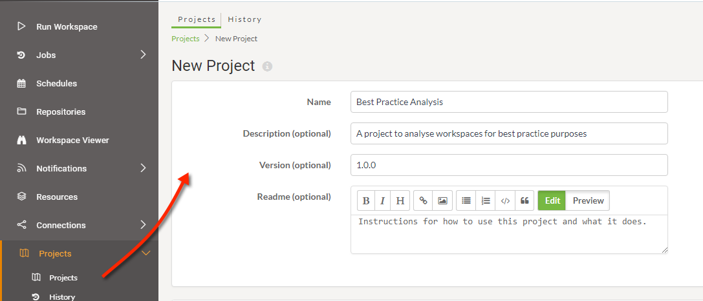
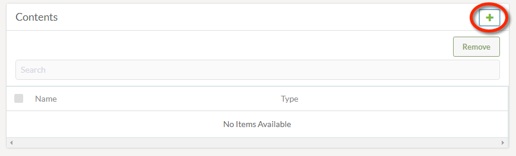
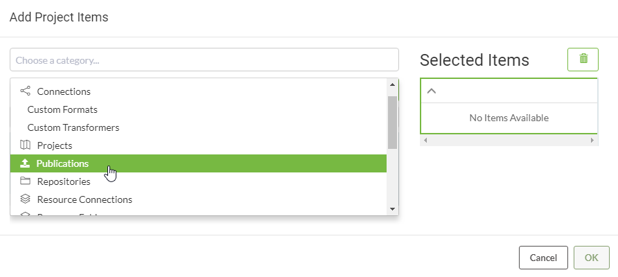
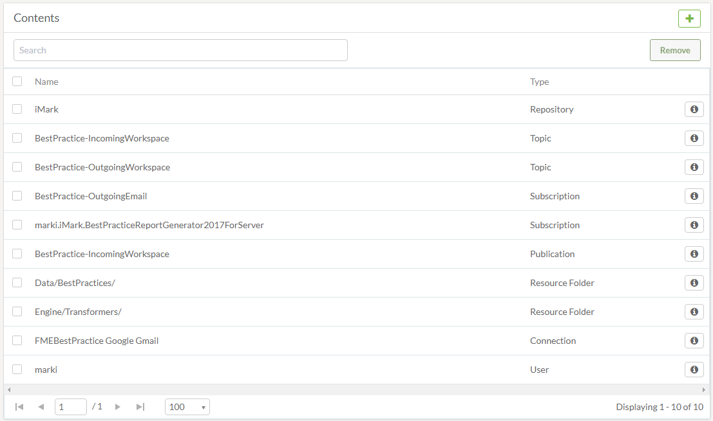
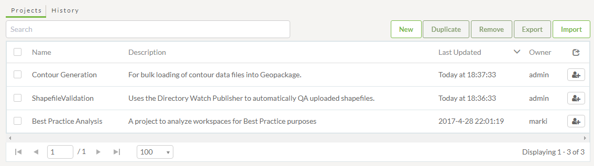

# 创建项目

创建项目涉及启动创建过程，然后只需将所需组件添加到该项目。

## 创建项目 ##

通过单击“新建”按钮并输入一些基本项目设置（如“名称”和“描述”），可以在“项目”页面（通过主菜单访问）上创建项目：

项目设置下方是一个对话框，显示当前添加到项目中的所有内容（如果有），并在右侧有一个添加新项目按钮：

单击“+”按钮将打开“添加项目项”对话框，该对话框允许将组件添加到项目中：

将一些项添加到项目后，它们将列在“内容”对话框下：

完成后，项目将添加到“项目”登录页面的列表中：

