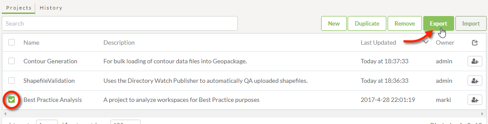
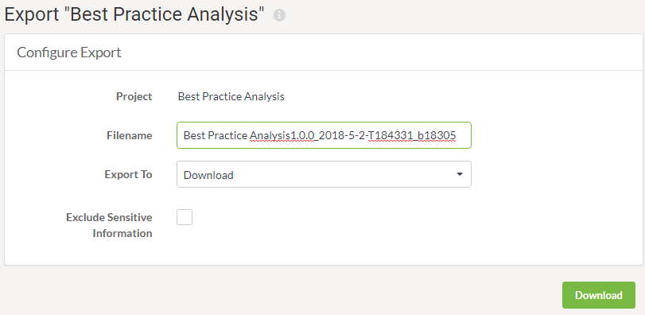

# 管理项目

项目的主要用途是将一组FME Server组件从一个Server实例传输到另一个Server实例。这是通过使用导出和导入工具执行的。还有一个用于从系统中删除项目的工具。

## 导出项目 ##

通过选择要导出的项目并单击“导出”按钮，可以在“项目”页面（通过主菜单访问）上导出项目：

这将打开一个对话框，用于配置和执行导出：

导出将写入具有.fsproject扩展名的文件。可以选择将导出作为下载提供，也可以将其写入资源文件夹。

---

<!--Person X Says Section-->

<table style="border-spacing: 0px">
<tr>
<td style="vertical-align:middle;background-color:darkorange;border: 2px solid darkorange">
<i class="fa fa-quote-left fa-lg fa-pull-left fa-fw" style="color:white;padding-right: 12px;vertical-align:text-top"></i>
Vector小姐说...
</td>
</tr>

<tr>
<td style="border: 1px solid darkorange">

如果您选择将项目导出到资源文件夹（而不是下载它），那么您还可以获得哪些额外功能？ 
  <a href="http://52.73.3.37/fmedatastreaming/Manual/QAResponse2017.fmw?chapter=25&question=2&answer=1&DestDataset_TEXTLINE=C%3A%5CFMEOutput%5CQAResponse.html">1. 在完成导出时触发通知主题的能力。</a>
 <a href="http://52.73.3.37/fmedatastreaming/Manual/QAResponse2017.fmw?chapter=25&question=2&answer=2&DestDataset_TEXTLINE=C%3A%5CFMEOutput%5CQAResponse.html">2. 导出服务器的FME许可证的能力。</a>
 <a href="http://52.73.3.37/fmedatastreaming/Manual/QAResponse2017.fmw?chapter=25&question=2&answer=3&DestDataset_TEXTLINE=C%3A%5CFMEOutput%5CQAResponse.html">3. 在导出项目时删除项目的所有组件的能力。</a>
 <a href="http://52.73.3.37/fmedatastreaming/Manual/QAResponse2017.fmw?chapter=25&question=2&answer=4&DestDataset_TEXTLINE=C%3A%5CFMEOutput%5CQAResponse.html">4. 将组件的所有权更改为您自己的用户帐户的能力。</a>

</td>
</tr>
</table>
