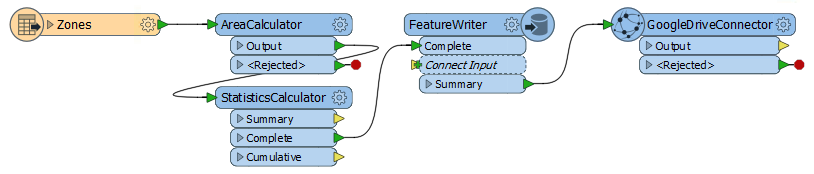
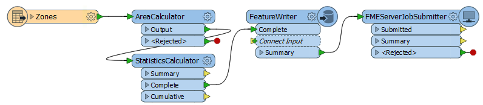
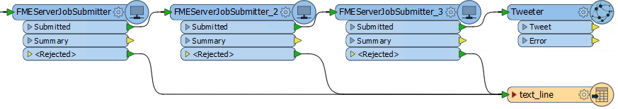
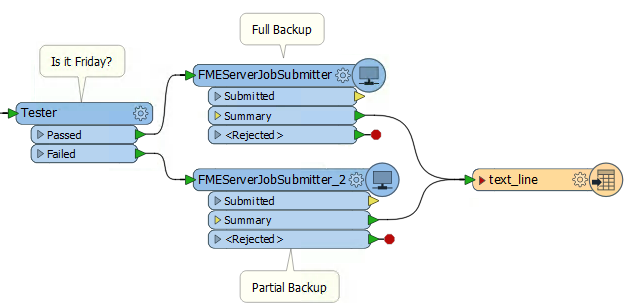
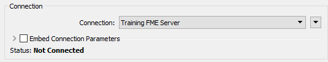
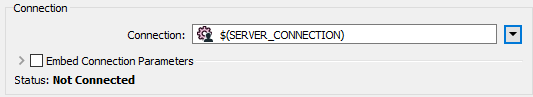

  

    <article class="markdown-body entry-content" itemprop="text"><h1>编写作业链</h1>

工作流管理是一种使用内置逻辑按顺序或分支控制工作空间的技术。这项技术的一部分是能够编写“链接在一起”的工作空间，以便一个接一个地运行。

<h2>什么是作业链？</h2>

作业链是一个接一个顺序运行的作业。实现这一点有多种方法。

<h3>FeatureWriter转换器</h3>

最简单的方法来链接工作空间…不是！链通常是必需的，因为一个工作空间写入下一个工作空间必须处理的数据。但是，FeatureWriter转换器允许写入数据，然后在同一工作空间内进行进一步的转换！

在上述工作空间中，验证数据并根据错误类型将验证错误写出到一系列数据集。这些数据集将上传到Amazon S3，并发送推文以提醒某人注意问题。

如果没有FeatureWriter，这样的项目可能会将两个或三个工作空间链接在一起。这里只需要一个。

<h3>一个简单的链</h3>

让一个工作空间运行另一个工作空间相对简单; 所需要的只是用于发送命令的转换器或关闭脚本。假设FME Server中的每个工作空间都可以使用URL运行，并且有一个REST API可以类似地执行，那么使用HTTPCaller转换器或关闭脚本来运行HTTP命令非常简单。

或者，可以使用FMEServerJobSubmitter转换器。此转换器触发工作空间在FME Server上运行。它具有各种参数，允许作者定义要在其上运行FME Server的工作空间。

通过将此转换器添加到多个工作空间，可以创建几乎任何长度的链。

在此工作空间中，数据将发送到FeatureWriter转换器，并将其结果作为单个摘要要素发送，以触发FMEServerJobSubmitter。

但是，不要认为FeatureWriter是数据链的必需品。对于链中不写数据的步骤同样有效，但只需执行操作并触发下一步。

<table>
<tbody><tr>
<td>
<i></i>
Intuitive修女说......
</td>
</tr>
<tr>
<td>

链中的第一个工作空间可以从读取源数据集的读模块开始，其中每个源要素都会触发FMEServerJobSubmitter。例如，源数据可以是要转换的文件列表。
  但更常见的是，下一个作业只需要触发一次。这只需要一个要素，并且可以使用Creator转换器代替读模块，或者使用Sampler转换器将要素流限制为单个。

</td>
</tr>
</tbody></table>

<h3>父-子方法</h3>

不同于一个工作空间调用下一个工作空间的工作空间链，另一种方法是拥有一个控制(父)工作空间，该工作区依次运行一系列(子)工作空间。

与一个简单链类似，主工作空间通过使用转换器（如FMEServerJobSubmitter）运行其他工作空间。

这里的控制工作空间使用FMEServerJobSubmitter来运行另外三个FME工作空间。也许每个工作空间都是数据库更新过程中的一个单独步骤：

如果某个特定任务失败，则输出将路由到文本文件写模块  - 这意味着可以在通知系统中使用该文件向管理员发送电子邮件，提醒他们注意失败。在成功执行所有三个结果时发送推文。

这种设置有时也被称为“主-从”方法，而不是“父-子”。

<h3>条件处理</h3>

在某些情况下，可能存在多个工作空间，其中只应运行其中一个工作空间。为此，可以使用Tester或其他筛选转换器来确定执行哪个工作空间的逻辑。

例如，在这里，组织运行一个每日进程，将字段更新上传到数据库中。每周一次，它也会做同样的事情，但也会将所有文件导出到Dropbox(例如):

测试由Tester,执行，每天/每周进程都在一个单独的工作空间中定义。

<h3>FMEServerJobSubmitter和Portability</h3>

FMEServerJobSubmitter转换器允许选择FME Server连接 - 与“工作空间发布”向导的方式相同：

但是，许多FME Server项目包括不是一个，而是两个服务器：一个用于开发和测试，另一个用于实时系统。

如果使用连接到MyFMEServerDev（例如）的FMEServerJobSubmitter开发解决方案，那么为了省去手动更改每个MyFMEServerLive转换器，可以将连接设置为用户参数：

<table>
<tbody><tr>
<td>
<i></i>
警察局长Webb-Mapp说......
</td>
</tr>
<tr>
<td>

另一种方法是使用FME Server参数 <strong>FME_SERVER_HOST</strong>和 <strong>FME_SERVER_PORT</strong>。
  您需要嵌入连接参数（而不是使用预定义的连接）并将FME Server URL设置为<strong> $(FME_SERVER_HOST):$(FME_SERVER_PORT)</strong>
  这样工作空间将根据发布到哪个服务器而起作用，而不必设置发布的参数。但是，它确实意味着您无法在FME Desktop上对其进行测试，并且每个子（从）工作空间都需要与父（主）工作在同一FME Server上。 

</td>
</tr>
</tbody></table>

 
<table>
<tbody><tr>
<td>
<i></i>
警告
</td>
</tr>
<tr>
<td>

有趣的是，初始/控制/父工作空间可以在FME Desktop（即Workbench）或FME Server上运行。FMEServerJobSubmitter适用于两个平台。因此，您可以使用在Desktop上执行的主控工作空间触发整个进程在Server上运行。
  但是，有一点不同。在FME Desktop上，主控工作空间立即运行，但由FMEServerJobSubmitter转换器执行的每个子作业都将提交到FME Server队列，并且可能必须等待引擎。 
  在FME Server上 - 如果您有设置“等待作业完成=是” - 则相反：主控工作空间提交到队列，但FMEServerJobSubmitter执行的每个子作业都会绕过队列并立即运行。 
  这意味着在桌面上，子进程受FMEServerJobSubmitter作业优先级和作业标记参数的影响。但是，在服务器上（当“等待作业=是”）时，将忽略这些参数，因为子进程立即运行而不是排队。 
  简而言之，这些FMEServerJobSubmitter参数仅适用于来自FME桌面的调用，因为只有在那时作业才排队。 
</td>
</tr>
</tbody></table>
</article>
  

