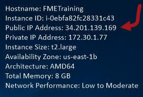
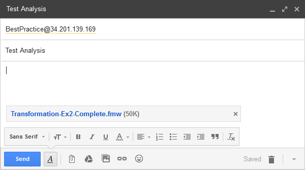

  

    <article class="markdown-body entry-content" itemprop="text">
<table>
<tbody><tr>
<td width="25%">
<i></i>
练习6.1
</td>
<td>
最佳实践工作空间分析项目
</td>
</tr>
<tr>
<td>数据</td>
<td>工作空间文件文件</td>
</tr>
<tr>
<td>总体目标</td>
<td>导入FME Server项目</td>
</tr>
<tr>
<td>演示</td>
<td>FME Server项目</td>
</tr>
<tr>
<td>启动工作空间文件</td>
<td>N / A</td>
</tr>
<tr>
<td>结束工作空间文件</td>
<td>N / A</td>
</tr>
</tbody></table>

最佳实践是FME工作空间的基本概念。为了鼓励同事执行最佳实践，您希望安装一个允许分析工作空间的项目。

 <strong>1）浏览到项目</strong>
 打开FME Server Web界面并使用具有管理员权限的帐户登录。

在主菜单上选择Projects以浏览到Projects页面：

 <strong>2）导入项目</strong>
 单击“导入”按钮以打开“导入”页面：

在“配置导入”部分下，确保将“导入自”设置为“上传”。然后在配置参数后，单击“导入”按钮：

<em>覆盖现有项</em>不太重要，因为项目应该还不存在对于需要覆盖的项来说。同样，<em>暂停通知系统</em>并不重要，因为项目中的通知不太可能立即触发（它们用于处理传入的电子邮件）。

单击Upload File按钮并浏览到Code Smells Workshop并选择BestPracticeAnalysis.fsproject：

<pre>C：\ FMEData2018 \资源\ CodeSmellsWorkshop \ BestPracticeAnalysis.fsproject
</pre>

该项目将很快导入：

 <strong>3）检查日志</strong>
 单击“查看详细信息”按钮以检查“项目导入”日志。成功导入将如下所示：

<table>
<tbody><tr>
<td>
<i></i>
技巧
</td>
</tr>
<tr>
<td>

项目下的历史页面将显示已导入系统的所有项目的完整历史记录。

</td>
</tr>
</tbody></table>

 <strong>4）检查组件</strong>
 现在让我们检查一些应该导入的组件。

再次单击菜单上的“项目”，然后选择最近导入的项目。您现在应该看到导入内容的列表：

使用菜单选项检查“存储库”，“通知”和“资源”页面，以确保导入的组件确实存在。

 <strong>5）测试项目</strong>
 现在让我们发送一封电子邮件到您的FME Server来测试项目。此处假设您使用的是具有公共名称，域或地址的服务器。

对于Safe的培训计算机上的FME Server，公共IP地址显示在桌面的右上角：

电子邮件地址为BestPractice @ xxxx，其中xxxx是IP地址：

设置主题行并附加工作空间文件文件。单击“发送”按钮。作为回应（可能需要一两分钟），您将收到有关该工作空间文件中使用的最佳实践的电子邮件报告：

这表明项目已导入并正确设置。

 <strong>6）清理项目</strong>
 项目中不需要的一部分是用户帐户。

因此，返回项目内容，选择marki User，然后将其删除。

这将从项目中删除该帐户，但由于该项目已导入，因此该帐户也将存在于该计算机上。因此，也可以转到Security&gt; Users页面并删除该用户。

发送另一封电子邮件以确认项目仍在运行。

 <strong>7）导出项目</strong>
 现在项目已经更新，将其导出，以便可以在其他地方以适当的形式导入。

为此，请浏览到“项目”页面，选择项目（使用左侧的复选框），然后单击“导出”按钮。

在打开的对话框中，您可以选择是将项目文件保存到下载还是资源文件夹。完成后，将显示以下消息：

<table>
<tbody><tr>
<td>
<i></i>
恭喜
</td>
</tr>
<tr>
<td>

通过完成本练习，您已学会如何：
 
<ul><li>导入项目</li>
<li>检查项目历史记录并确认已成功导入项目</li>
<li>编辑项目的内容</li>
<li>导出项目</li></ul>

</td>
</tr>
</tbody></table>   
</article>
  

