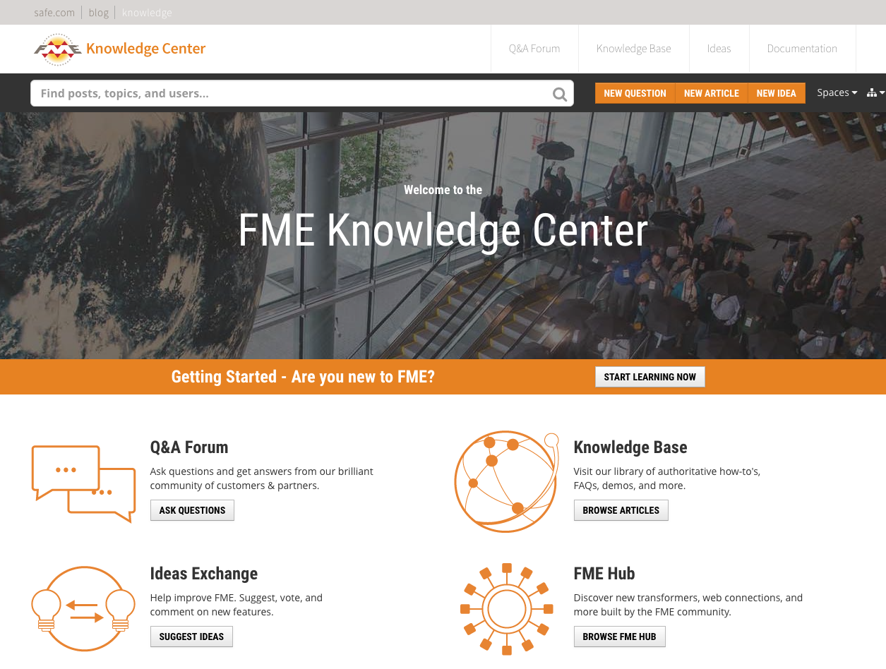
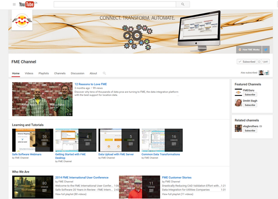

# 社区信息和资源 #
Safe Software积极推动FME用户成为FME社区的一员。

## FME知识中心 ##
**[FME知识中心](https://knowledge.safe.com/ "FME Knowledge Center")** 是我们的社区网站-所有社区资源的一站式商店，加上浏览文档和下载工具。

### 知识基地 ###
FME知识基地包含大量信息; 包括提示，技巧，示例和常见问题解答。都有一些部分关于FME Desktop和FME Server，其中包含从安装和许可到最高级转换和变换任务等主题的文章。

### 问答论坛 ###
FME社区成员发布与FME相关的消息，提出问题并分享回答其他用户的问题。会员获得“声誉”和“徽章”，并且有顶级参与用户的排行榜。快来看看他们如何帮助您的FME项目！

### 想法交流 ###
FME开发非常依赖于用户。Ideas 交流让用户有机会发布他们对新FME功能的想法，或对现有功能的改进，并允许每个人对提议的想法进行投票。想法获得的投票越多，实施的可能性就越大！

---

## FME频道 ##
此 **[FME YouTube频道](https://www.youtube.com/user/FMEchannel "FME YouTube Channel")** 适用于只能通过截屏视频或电影正常欣赏的演示。除此之外，还有许多解释性和有用的电影，包括大多数培训和教程的录音。

